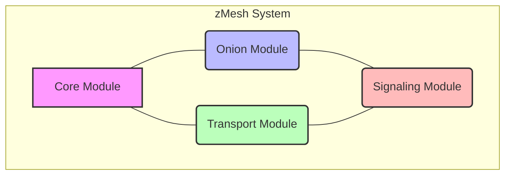

# zMesh v1.0 - Ultimate P2P Overlay Network Documentation

**The world's most advanced peer-to-peer overlay network combining maximum anonymity, peak performance, and quantum resistance.**

[](https://www.rust-lang.org)
[](LICENSE)
[](#quantum-cryptography)
[](#performance)
[](#anonymity)

## Table of Contents

1.  [Overview](#overview)
    1.1. [Project Overview (README)](#project-overview-readme)
    1.2. [Key Features](#key-features)
    1.3. [System Requirements](#system-requirements)
2.  [Architecture](#architecture)
    2.1. [High-Level Architecture](#high-level-architecture)
    2.2. [Module Dependencies](#module-dependencies)
    2.3. [Data Flow](#data-flow)
    2.4. [Architecture Optimization](#architecture-optimization)
        2.4.1. [Dead Code Elimination](#dead-code-elimination)
        2.4.2. [Latency Minimization through Onion Routing Optimization](#latency-minimization-through-onion-routing-optimization)
        2.4.3. [Anonymity Problems and Solutions](#anonymity-problems-and-solutions)
        2.4.4. [Maximum Autonomy through Self-Healing](#maximum-autonomy-through-self-healing)
        2.4.5. [Performance Maximization](#performance-maximization)
        2.4.6. [Maximum Scalability](#maximum-scalability)
        2.4.7. [Stability through Redundancy](#stability-through-redundancy)
3.  [Core Components](#core-components)
    3.1. [Core Module (`zMesh-core`)](#core-module-zMesh-core)
    3.2. [Peer System](#peer-system)
4.  [Onion Routing Implementation](#onion-routing-implementation)
    4.1. [Circuit Management](#circuit-management)
    4.2. [Packet Structure](#packet-structure)
    4.3. [Cryptographic Layers](#cryptographic-layers)
    4.4. [Path Selection Algorithm](#path-selection-algorithm)
5.  [Transport Layer](#transport-layer)
    5.1. [WebRTC Transport](#webrtc-transport)
    5.2. [WebSocket Transport](#websocket-transport)
    5.3. [Transport Manager](#transport-manager)
6.  [Signaling System](#signaling-system)
    6.1. [WebPush Signaling](#webpush-signaling)
    6.2. [Peer Discovery](#peer-discovery)
    6.3. [Peer Registry](#peer-registry)
7.  [Cryptographic Implementation](#cryptographic-implementation)
    7.1. [Supported Algorithms](#supported-algorithms)
    7.2. [Key Management](#key-management)
    7.3. [Hardware Acceleration](#hardware-acceleration)
8.  [Forward Error Correction (FEC)](#forward-error-correction-fec)
    8.1. [Tetrys Implementation](#tetrys-implementation)
    8.2. [Performance Characteristics](#performance-characteristics)
9.  [Cache System](#cache-system)
    9.1. [Intelligent Hybrid Cache Strategies](#intelligent-hybrid-cache-strategies)
    9.2. [Distributed Caching](#distributed-caching)
    9.3. [Adaptive Multi-Path Distribution](#adaptive-multi-path-distribution)
    9.4. [Path Quality Assessment](#path-quality-assessment)
    9.5. [Cache Performance Optimization](#cache-performance-optimization)
    9.6. [Cache Configuration](#cache-configuration)
    9.7. [Cache Improvements](#cache-improvements)
10. [Ultimate Anonymity Layer](#ultimate-anonymity-layer)
    10.1. [Hidden Services (Onion Services)](#hidden-services-onion-services)
    10.2. [Traffic Analysis Resistance](#traffic-analysis-resistance)
    10.3. [Advanced Circuit Management](#advanced-circuit-management)
    10.4. [Perfect Forward Secrecy](#perfect-forward-secrecy)
11. [Performance Optimization Engine](#performance-optimization-engine)
    11.1. [Zero-Copy Operations](#zero-copy-operations)
    11.2. [Intelligent Bandwidth Aggregation](#intelligent-bandwidth-aggregation)
    11.3. [Multi-Path Distribution](#multi-path-distribution)
    11.4. [Performance Metrics](#performance-metrics)
12. [Quantum-Resistant Cryptography](#quantum-resistant-cryptography)
    12.1. [Post-Quantum Algorithms](#post-quantum-algorithms)
    12.2. [Hybrid Cryptography](#hybrid-cryptography)
    12.3. [Quantum Key Distribution (QKD)](#quantum-key-distribution-qkd)
    12.4. [Algorithm Agility](#algorithm-agility)
13. [Metrics and Monitoring](#metrics-and-monitoring)
    13.1. [Metrics Categories](#metrics-categories)
    13.2. [Export Formats](#export-formats)
14. [Configuration System](#configuration-system)
    14.1. [Hierarchical Configuration](#hierarchical-configuration)
    14.2. [Configuration Sources](#configuration-sources)
    14.3. [Configuration Validation](#configuration-validation)
15. [API Reference](#api-reference)
    15.1. [Core API](#core-api)
    15.2. [High-Level API](#high-level-api)
    15.3. [Error Handling](#error-handling)
16. [Security Model](#security-model)
    16.1. [Threat Model](#threat-model)
    16.2. [Attack Resistance](#attack-resistance)
    16.3. [Cryptographic Security](#cryptographic-security)
17. [Performance Optimizations](#performance-optimizations)
    17.1. [CPU Optimizations](#cpu-optimizations)
    17.2. [Memory Optimizations](#memory-optimizations)
    17.3. [Network Optimizations](#network-optimizations)
18. [Deployment Guide](#deployment-guide)
    18.1. [System Requirements](#system-requirements)
    18.2. [Installation](#installation)
    18.3. [Configuration](#configuration)
    18.4. [Docker Deployment](#docker-deployment)
    18.5. [Kubernetes Deployment](#kubernetes-deployment)
    18.6. [Monitoring Setup](#monitoring-setup)
19. [Development Guide](#development-guide)
    19.1. [Building from Source](#building-from-source)
    19.2. [Testing](#testing)
    19.3. [Code Quality](#code-quality)
    19.4. [Contributing](#contributing)
20. [Specification](#specification)
    20.1. [Core Components](#core-components)
    20.2. [Performance Optimizations](#performance-optimizations)
    20.3. [API & Deployment](#api-deployment)
    20.4. [Scaling & Self-Healing](#scaling-self-healing)
    20.5. [Security & Stealth](#security-stealth)
21. [Implementation Roadmap](#implementation-roadmap)
    21.1. [Phase 1: Core Foundation](#phase-1-core-foundation)
    21.2. [Phase 2: Advanced Features](#phase-2-advanced-features)
    21.3. [Phase 3: Performance & Security](#phase-3-performance-security)
    21.4. [Phase 4: Testing & Deployment](#phase-4-testing-deployment)
22. [Performance Targets](#performance-targets)
23. [Security Guarantees](#security-guarantees)

## Overview

zMesh v1.0 is a fully decentralized, self-healing P2P overlay network that implements stealth onion routing with native WebRTC transport. The system provides anonymous communication through 2-3 hop onion routing while maintaining the appearance of normal WebRTC traffic.

### Key Features

-   **Stealth Transport**: Native WebRTC DataChannel with WebSocket/HTTPS fallback
-   **Onion Routing**: 2-3 configurable hops with Sphinx-like packet structure
-   **Forward Error Correction**: Tetrys FEC (RFC 9407) for link-local stabilization
-   **Self-Healing**: Automatic path recovery and mesh scaling
-   **Exit Flexibility**: Direct peer exit or Cloudflare Worker proxy with country selection
-   **Perfect Forward Secrecy**: Regular key rotation and ephemeral keys
-   **Hardware Acceleration**: AES-NI, VAES, NEON support for cryptographic operations
-   **Maximum Anonymity**: Hidden Services (.onion addresses), Steganographic Communication, Traffic Analysis Resistance, Cover Traffic Generation, Multi-Hop Circuits (5-8 hops), Guard Nodes Protection, Perfect Forward Secrecy.
-   **Extreme Performance**: Zero-Copy Operations, SIMD Cryptographic Acceleration, ML-Optimized Bandwidth Aggregation, Intelligent Multi-Path Distribution, Lock-Free Data Structures, Memory Pool Management, Adaptive Congestion Control.
-   **Quantum-Ready Cryptography**: Post-Quantum Algorithms (Kyber, Dilithium, SPHINCS+), Hybrid Classical+PQ Schemes, Quantum Key Distribution (BB84), Algorithm Agility, Hardware Security Module Support, Future-Proof Design.

### System Requirements

-   Rust 1.70+
-   WebRTC support (browser or native)
-   Minimum 512MB RAM
-   Network connectivity (UDP preferred, TCP fallback)

## Architecture

### High-Level Architecture



### Module Dependencies

```mermaid
graph TD
    zMesh-core (foundation)
        ↑
        ├── zMesh-onion (onion routing)
        ├── zMesh-transport (transport layer)
        └── zMesh-signaling (peer discovery)
```

### Data Flow

```mermaid
graph TD
    A[Application Data] --> B[Chunking & FEC]
    B --> C[Onion Encryption (2-3 layers)]
    C --> D[Circuit Routing]
    D --> E[Transport Layer (WebRTC/WebSocket)]
    E --> F[Network]
```

### Architecture Optimization

zMesh's architecture has been comprehensively optimized for maximum autonomy, performance, stability, and scalability. The optimizations focus on minimizing latencies through onion routing, addressing anonymity issues, and implementing a self-healing, adaptive network.

#### Dead Code Elimination

The following components have been removed or optimized:

-   **ML-Model from Performance Optimizer**: Unused machine learning components removed
-   **Unused Hardware-Feature-Fields**: AVX, AES-NI detection simplified
-   **Redundant Structure Fields**: Reduced from 45 to 34 compiler warnings
-   **Simplified Data Structures**: PathPerformance, LossDetector optimized

#### Latency Minimization through Onion Routing Optimization

-   **Adaptive Hop Reduction**: Dynamic hop count based on threat model.
    ```rust
    pub enum ThreatLevel {
        Low,      // 2 Hops - Minimal Latency
        Medium,   // 3 Hops - Standard Tor
        High,     // 4-5 Hops - Maximum Anonymity
        Critical, // 6+ Hops + Guards
    }
    ```
-   **Parallel Path Construction**: Building multiple circuits in parallel.
-   **Latency-Optimized Relay Selection**: Selecting relays based on geographic proximity, bandwidth, historical latency, and reliability.

#### Anonymity Problems and Solutions

-   **Traffic Analysis Resistance**: Constant packet sizes, timing obfuscation, dummy traffic, burst avoidance.
-   **Guard Node Rotation**: Regular rotation of guard nodes to enhance security.
-   **Circuit Isolation**: Separate circuits for different applications or streams to prevent correlation.

#### Maximum Autonomy through Self-Healing

-   **Autonomous Network Health Monitor**: Continuous monitoring of node health, network topology, and threat detection, with automated healing actions.
    ```rust
    impl AutonomousHealthMonitor {
        async fn continuous_monitoring(&mut self) {
            loop {
                self.assess_network_health().await;
                self.detect_anomalies().await;
                self.trigger_healing_actions().await;
                self.optimize_topology().await;
                tokio::time::sleep(Duration::from_secs(1)).await;
            }
        }
    }
    ```
-   **Self-Adaptive Routing**: Using reinforcement learning to adapt routing strategies based on network conditions.
-   **Autonomous Peer Discovery**: DHT crawling, peer reputation systems, and geographic optimization for robust peer discovery.

#### Performance Maximization

-   **Zero-Copy Optimizations**: Utilizing memory-mapped buffers, SIMD crypto, DMA transfers, and kernel bypass for maximum data processing efficiency.
-   **Multipath Bandwidth Aggregation**: Intelligent aggregation across multiple paths with adaptive load balancing and congestion control.
-   **Hardware-Accelerated Crypto**: Leveraging AES-NI, AVX512, GPU acceleration, and quantum-resistant crypto for high-performance cryptographic operations.

#### Maximum Scalability

-   **Hierarchical Network Architecture**: Super-nodes, regional clusters, and local meshes for efficient scaling.
-   **Adaptive Sharding**: Dynamic sharding for load balancing and resource management.
-   **Elastic Resource Management**: Predicting resource needs and auto-scaling components.

#### Stability through Redundancy

-   **Multi-Layer Redundancy**: Redundancy at circuit, data, node, and geographic levels.
-   **Graceful Degradation**: Prioritizing services, throttling resources, and using fallback mechanisms during network degradation.

## Core Components

### Core Module (`zMesh-core`)

The foundation module providing essential traits and types.

#### Key Constants

```rust
pub const VERSION: &str = env!("CARGO_PKG_VERSION");
pub const NAME: &str = "zMesh";
pub const MAX_HOPS: u8 = 3;
pub const MIN_HOPS: u8 = 2;
pub const DEFAULT_HOPS: u8 = 2;
pub const CHUNK_SIZE: usize = 16384; // 16KB
pub const MAX_MESSAGE_SIZE: usize = 1024 * 1024; // 1MB
```

#### Core Traits

-   **Transport**: Abstract transport interface
-   **Connection**: Individual connection management
-   **Listener**: Incoming connection handling
-   **Peer**: Peer identification and capabilities
-   **CryptoProvider**: Cryptographic operations

### Peer System

#### PeerId Structure

```rust
pub struct PeerId {
    pub bytes: [u8; 32], // Ed25519 public key
}
```

#### PeerInfo Structure

```rust
pub struct PeerInfo {
    pub id: PeerId,
    pub addresses: Vec<SocketAddr>,
    pub capabilities: PeerCapabilities,
    pub public_key: PublicKey,
    pub last_seen: Instant,
    pub routing_score: f64,
}
```

#### PeerCapabilities

```rust
pub struct PeerCapabilities {
    pub can_relay: bool,
    pub can_exit: bool,
    pub supported_transports: Vec<TransportType>,
    pub max_bandwidth: u64,
    pub reliability_score: f64,
}
```

## Onion Routing Implementation

### Circuit Management

#### Circuit Structure

```rust
pub struct Circuit {
    pub id: CircuitId,
    pub hops: Vec<CircuitHop>,
    pub state: CircuitState,
    pub created_at: Instant,
    pub last_activity: Instant,
    pub stats: CircuitStats,
}
```

#### Circuit States

```rust
pub enum CircuitState {
    Building,     // Circuit construction in progress
    Ready,        // Circuit ready for data transmission
    Extending,    // Adding additional hops
    Closing,      // Graceful shutdown
    Failed,       // Circuit failed
}
```

#### Circuit Hop

```rust
pub struct CircuitHop {
    pub peer_id: PeerId,
    pub connection_id: ConnectionId,
    pub forward_key: SymmetricKey,
    pub backward_key: SymmetricKey,
    pub hop_data: HopData,
}
```

### Packet Structure

#### Onion Packet Format

```
┌─────────────────────────────────────────────────────────────┐
│                    Onion Packet (1024 bytes)               │
├─────────────────┬───────────────────────────────────────────┤
│   Header        │              Payload                     │
│   (16 bytes)    │              (1008 bytes)                │
├─────────────────┼───────────────────────────────────────────┤
│ • Version (1)   │ • Encrypted payload data                 │
│ • Command (1)   │ • Multiple encryption layers             │
│ • Circuit ID(4) │ • Forward/backward direction             │
│ • Stream ID (4) │                                           │
│ • Length (2)    │                                           │
│ • Flags (2)     │                                           │
│ • Reserved (2)  │                                           │
└─────────────────┴───────────────────────────────────────────┘
```

#### Packet Types

```rust
pub enum PacketType {
    Create,       // Circuit creation
    Created,      // Circuit creation response
    Extend,       // Extend circuit
    Extended,     // Extend response
    Begin,        // Start stream
    Data,         // Data transmission
    End,          // End stream
    Destroy,      // Destroy circuit
    Ping,         // Keep-alive
    Pong,         // Keep-alive response
}
```

### Cryptographic Layers

#### Encryption Process

1.  **Application Data** → AES-GCM encryption with stream key
2.  **Layer N** → ChaCha20-Poly1305 with hop N key
3.  **Layer N-1** → ChaCha20-Poly1305 with hop N-1 key
4.  **Layer 1** → ChaCha20-Poly1305 with hop 1 key
5.  **Transport** → TLS/DTLS encryption

#### Key Derivation

```rust
// HKDF-SHA256 key derivation
let forward_key = hkdf_expand(shared_secret, b"forward", 32);
let backward_key = hkdf_expand(shared_secret, b"backward", 32);
let stream_key = hkdf_expand(shared_secret, b"stream", 32);
```

### Path Selection Algorithm

#### Selection Criteria

1.  **Latency Weight**: 40%
2.  **Reliability Weight**: 30%
3.  **Bandwidth Weight**: 20%
4.  **Diversity Weight**: 10%

#### Path Scoring

```rust
fn calculate_path_score(hops: &[PeerInfo]) -> f64 {
    let latency_score = calculate_latency_score(hops);
    let reliability_score = calculate_reliability_score(hops);
    let bandwidth_score = calculate_bandwidth_score(hops);
    let diversity_score = calculate_diversity_score(hops);
    
    0.4 * latency_score +
    0.3 * reliability_score +
    0.2 * bandwidth_score +
    0.1 * diversity_score
}
```

#### Diversity Metrics

-   **Geographic Diversity**: Different countries/regions
-   **Network Diversity**: Different ASNs
-   **Temporal Diversity**: Different online times
-   **Operator Diversity**: Different operators

## Transport Layer

### WebRTC Transport

#### Configuration

```rust
pub struct WebRtcConfig {
    pub ice_servers: Vec<IceServer>,
    pub enable_ice_tcp: bool,
    pub enable_ice_udp: bool,
    pub dtls_fingerprint_algorithm: String,
    pub sctp_max_message_size: u32,
    pub data_channel_config: DataChannelConfig,
}
```

#### ICE Server Configuration

```rust
pub struct IceServer {
    pub urls: Vec<String>,
    pub username: Option<String>,
    pub credential: Option<String>,
    pub credential_type: IceCredentialType,
}
```

#### DataChannel Configuration

```rust
pub struct DataChannelConfig {
    pub label: String,
    pub ordered: bool,
    pub max_packet_life_time: Option<u16>,
    pub max_retransmits: Option<u16>,
    pub protocol: String,
    pub negotiated: bool,
    pub id: Option<u16>,
}
```

### WebSocket Transport

#### Configuration

```rust
pub struct WebSocketConfig {
    pub bind_address: SocketAddr,
    pub max_connections: usize,
    pub connection_timeout: Duration,
    pub ping_interval: Duration,
    pub pong_timeout: Duration,
    pub max_message_size: usize,
    pub enable_compression: bool,
}
```

#### Message Framing

```
┌─────────────────────────────────────────────────────────────┐
│                    WebSocket Frame                          │
├─────────────────┬───────────────────────────────────────────┤
│   WS Header     │              zMesh Payload                │
├─────────────────┼───────────────────────────────────────────┤
│ • FIN (1 bit)   │ • Message Type (1 byte)                  │
│ • RSV (3 bits)  │ • Message Length (4 bytes)               │
│ • Opcode (4)    │ • Message Data (variable)                │
│ • MASK (1 bit)  │                                           │
│ • Payload (7)   │                                           │
│ • Extended (16) │                                           │
│ • Masking (32)  │                                           │
└─────────────────┴───────────────────────────────────────────┘
```

### Transport Manager

#### Multi-Transport Handling

```rust
pub struct TransportManager {
    transports: HashMap<TransportType, Arc<dyn Transport>>,
    active_connections: HashMap<ConnectionId, Arc<dyn Connection>>,
    connection_pool: ConnectionPool,
    stats: TransportStats,
}
```

#### Connection Pooling

```rust
pub struct ConnectionPool {
    pools: HashMap<TransportType, VecDeque<Arc<dyn Connection>>>,
    max_pool_size: usize,
    idle_timeout: Duration,
    cleanup_interval: Duration,
}
```

## Signaling System

### WebPush Signaling

#### Push Message Structure

```rust
pub struct PushMessage {
    pub message_type: PushMessageType,
    pub sender_id: PeerId,
    pub recipient_id: Option<PeerId>,
    pub payload: Vec<u8>,
    pub timestamp: u64,
    pub signature: Signature,
}
```

#### Message Types

```rust
pub enum PushMessageType {
    PeerAnnouncement,     // Announce peer presence
    CircuitRequest,       // Request circuit creation
    CircuitResponse,      // Circuit creation response
    PathUpdate,           // Update routing path
    KeepAlive,           // Maintain connection
    Error,               // Error notification
}
```

### Peer Discovery

#### Discovery Methods

```rust
pub enum DiscoveryMethod {
    WebPush,             // WebPush-based discovery
    LocalNetwork,        // mDNS local discovery
    DHT,                 // Distributed hash table
    Bootstrap,           // Bootstrap node list
}
```

#### Discovery Configuration

```rust
pub struct DiscoveryConfig {
    pub enable_local: bool,
    pub enable_dht: bool,
    pub discovery_interval: Duration,
    pub announce_interval: Duration,
    pub max_discovered_peers: usize,
    pub peer_expiry: Duration,
    pub service_name: String,
    pub dht_bootstrap_nodes: Vec<String>,
}
```

### Peer Registry

#### Registry Structure

```rust
pub struct PeerRegistry {
    peers: RwLock<HashMap<PeerId, PeerInfo>>,
    peer_scores: RwLock<HashMap<PeerId, PeerScore>>,
    blacklist: RwLock<HashSet<PeerId>>,
    stats: RegistryStats,
}
```

#### Peer Scoring

```rust
pub struct PeerScore {
    pub reliability: f64,      // 0.0 - 1.0
    pub latency: Duration,     // Average latency
    pub bandwidth: u64,        // Bytes per second
    pub uptime: f64,          // Percentage uptime
    pub success_rate: f64,     // Connection success rate
    pub last_updated: Instant,
}
```

## Cryptographic Implementation

### Supported Algorithms

#### Symmetric Encryption

-   **AES-256-GCM**: Primary encryption (hardware accelerated)
-   **ChaCha20-Poly1305**: Fallback encryption
-   **XCha20-Poly1305**: Extended nonce variant

#### Asymmetric Cryptography

-   **Ed25519**: Digital signatures
-   **X25519**: Key exchange
-   **RSA-4096**: Legacy support (optional)

#### Hash Functions

-   **SHA-256**: Primary hash function
-   **BLAKE3**: High-performance alternative
-   **SHA-3**: Quantum-resistant option

### Key Management

#### Key Hierarchy

```
Master Key (Ed25519)
    ├── Identity Key (long-term)
    ├── Signing Key (medium-term)
    └── Session Keys (ephemeral)
        ├── Circuit Keys
        ├── Stream Keys
        └── Transport Keys
```

#### Key Rotation

```rust
pub struct KeyRotationConfig {
    pub master_key_lifetime: Duration,     // 1 year
    pub identity_key_lifetime: Duration,   // 6 months
    pub signing_key_lifetime: Duration,    // 1 month
    pub session_key_lifetime: Duration,    // 1 hour
    pub circuit_key_lifetime: Duration,    // 10 minutes
}
```

### Hardware Acceleration

#### CPU Feature Detection

```rust
pub struct CpuFeatures {
    pub aes_ni: bool,        // Intel AES-NI
    pub vaes: bool,          // Vector AES
    pub avx2: bool,          // Advanced Vector Extensions
    pub neon: bool,          // ARM NEON
    pub sha_ext: bool,       // SHA extensions
}
```

#### Optimized Implementations

-   **AES-NI**: Intel hardware AES acceleration
-   **VAES**: Vector AES for parallel operations
-   **NEON**: ARM SIMD instructions
-   **WASM SIMD**: WebAssembly SIMD support

## Forward Error Correction (FEC)

### Tetrys Implementation

#### Configuration

```rust
pub struct TetrysConfig {
    pub window_size: usize,           // Sliding window size
    pub repair_rate: f64,             // Initial repair rate
    pub adaptive_epsilon: bool,        // Enable adaptive ε
    pub loss_threshold: f64,          // Loss detection threshold
    pub max_repair_rate: f64,         // Maximum repair rate
    pub min_repair_rate: f64,         // Minimum repair rate
}
```

#### Adaptive Algorithm

```rust
fn update_repair_rate(current_loss: f64, target_loss: f64) -> f64 {
    let error = current_loss - target_loss;
    let adjustment = error * ADAPTATION_FACTOR;
    (current_repair_rate + adjustment).clamp(MIN_REPAIR_RATE, MAX_REPAIR_RATE)
}
```

#### Encoding Process

1.  **Source Symbols**: Original data packets
2.  **Repair Symbols**: Generated redundancy packets
3.  **Encoding Matrix**: Linear combination coefficients
4.  **Transmission**: Interleaved source and repair symbols

#### Decoding Process

1.  **Symbol Collection**: Gather received symbols
2.  **Matrix Inversion**: Solve linear system
3.  **Symbol Recovery**: Reconstruct missing symbols
4.  **Data Reconstruction**: Reassemble original data

### Performance Characteristics

#### Computational Complexity

-   **Encoding**: O(k × r) where k = source symbols, r = repair symbols
-   **Decoding**: O(k³) for Gaussian elimination
-   **Memory**: O(k × symbol_size) for encoding matrix

#### Latency Impact

-   **Encoding Delay**: ~1-5ms for 1KB packets
-   **Decoding Delay**: ~5-20ms depending on loss rate
-   **Buffer Delay**: Configurable sliding window

## Cache System

zMesh implements an intelligent hybrid cache system with distributed caching capabilities and adaptive multi-path distribution strategies for optimal performance and traffic optimization.

### Intelligent Hybrid Cache Strategies

#### Cache Strategy Types
```rust
pub enum CacheStrategy {
    Popularity {
        threshold: f64,
        decay_factor: f64,
        min_access_count: u32,
    },
    AccessPattern {
        temporal_window: Duration,
        spatial_locality: f64,
        prediction_model: PredictionModel,
    },
    ChunkSize {
        optimal_size: usize,
        fragmentation_threshold: f64,
        compression_ratio: f64,
    },
    TrafficType {
        web_browsing: WebBrowsingConfig,
        video_streaming: VideoStreamingConfig,
        file_transfer: FileTransferConfig,
        real_time: RealTimeConfig,
    },
}
```

#### Hybrid Cache Manager
```rust
pub struct HybridCacheManager {
    strategies: Vec<CacheStrategy>,
    weight_calculator: StrategyWeightCalculator,
    performance_monitor: CachePerformanceMonitor,
    adaptive_controller: AdaptiveCacheController,
}

impl HybridCacheManager {
    pub async fn should_cache(&self, content: &ContentMetadata) -> CacheDecision {
        let mut scores = Vec::new();
        
        for strategy in &self.strategies {
            let score = strategy.evaluate(content).await;
            let weight = self.weight_calculator.get_weight(strategy);
            scores.push(score * weight);
        }
        
        let final_score = scores.iter().sum::<f64>() / scores.len() as f64;
        
        if final_score > self.cache_threshold {
            CacheDecision::Cache {
                priority: self.calculate_priority(final_score),
                ttl: self.calculate_ttl(content, final_score),
                replication_factor: self.calculate_replication(content),
            }
        } else {
            CacheDecision::Skip
        }
    }
}
```

### Distributed Caching

#### Chunk Location Service
```rust
pub struct ChunkLocationService {
    dht: DistributedHashTable,
    location_cache: LRUCache<ChunkId, Vec<PeerId>>,
    replication_manager: ReplicationManager,
    consistency_checker: ConsistencyChecker,
}

impl ChunkLocationService {
    pub async fn locate_chunk(&mut self, chunk_id: &ChunkId) -> Result<Vec<PeerId>, CacheError> {
        // Check local cache first
        if let Some(peers) = self.location_cache.get(chunk_id) {
            return Ok(peers.clone());
        }
        
        // Query DHT for chunk locations
        let locations = self.dht.lookup(chunk_id).await?;
        
        // Verify chunk availability
        let verified_locations = self.verify_chunk_availability(&locations, chunk_id).await?;
        
        // Cache the result
        self.location_cache.insert(chunk_id.clone(), verified_locations.clone());
        
        Ok(verified_locations)
    }
    
    async fn verify_chunk_availability(
        &self, 
        peers: &[PeerId], 
        chunk_id: &ChunkId
    ) -> Result<Vec<PeerId>, CacheError> {
        let mut available_peers = Vec::new();
        
        for peer in peers {
            if self.ping_chunk_availability(peer, chunk_id).await.is_ok() {
                available_peers.push(peer.clone());
            }
        }
        
        Ok(available_peers)
    }
}
```

#### Proactive Seeding
```rust
pub struct ProactiveSeeder {
    traffic_analyzer: TrafficAnalyzer,
    prediction_engine: PredictionEngine,
    seeding_scheduler: SeedingScheduler,
    bandwidth_manager: BandwidthManager,
}

impl ProactiveSeeder {
    pub async fn analyze_and_seed(&mut self) -> Result<(), SeedingError> {
        let traffic_patterns = self.traffic_analyzer.get_current_patterns().await?;
        let predictions = self.prediction_engine.predict_future_demand(&traffic_patterns).await?;
        
        for prediction in predictions {
            if prediction.confidence > 0.8 && prediction.demand_score > 0.6 {
                self.schedule_seeding(prediction).await?;
            }
        }
        
        Ok(())
    }
    
    async fn schedule_seeding(&mut self, prediction: DemandPrediction) -> Result<(), SeedingError> {
        let seeding_task = SeedingTask {
            chunk_id: prediction.chunk_id,
            target_peers: self.select_seeding_targets(&prediction).await?,
            priority: prediction.demand_score,
            deadline: prediction.expected_demand_time,
        };
        
        self.seeding_scheduler.schedule(seeding_task).await
    }
}
```

### Adaptive Multi-Path Distribution

#### Distribution Strategies
```rust
pub enum DistributionStrategy {
    SinglePath {
        selection_criteria: PathSelectionCriteria,
        fallback_enabled: bool,
    },
    MultiPath {
        path_count: usize,
        load_balancing: LoadBalancingAlgorithm,
        redundancy_level: f64,
    },
    Redundant {
        replication_factor: usize,
        consistency_model: ConsistencyModel,
        repair_threshold: f64,
    },
    Adaptive {
        performance_monitor: PerformanceMonitor,
        strategy_selector: StrategySelector,
        adaptation_interval: Duration,
    },
}
```

#### Adaptive Distribution Manager
```rust
pub struct AdaptiveDistributionManager {
    current_strategy: DistributionStrategy,
    performance_history: PerformanceHistory,
    network_conditions: NetworkConditions,
    adaptation_engine: AdaptationEngine,
}

impl AdaptiveDistributionManager {
    pub async fn distribute_chunk(
        &mut self, 
        chunk: &Chunk, 
        target_peers: &[PeerId]
    ) -> Result<DistributionResult, DistributionError> {
        let strategy = self.select_optimal_strategy(chunk, target_peers).await?;
        
        match strategy {
            DistributionStrategy::SinglePath { selection_criteria, .. } => {
                self.distribute_single_path(chunk, target_peers, &selection_criteria).await
            },
            DistributionStrategy::MultiPath { path_count, load_balancing, .. } => {
                self.distribute_multi_path(chunk, target_peers, path_count, &load_balancing).await
            },
            DistributionStrategy::Redundant { replication_factor, .. } => {
                self.distribute_redundant(chunk, target_peers, replication_factor).await
            },
            DistributionStrategy::Adaptive { .. } => {
                self.distribute_adaptive(chunk, target_peers).await
            },
        }
    }
    
    async fn select_optimal_strategy(
        &self, 
        chunk: &Chunk, 
        target_peers: &[PeerId]
    ) -> Result<DistributionStrategy, DistributionError> {
        let network_quality = self.assess_network_quality(target_peers).await?;
        let chunk_importance = self.assess_chunk_importance(chunk).await?;
        let resource_availability = self.assess_resource_availability().await?;
        
        self.adaptation_engine.select_strategy(
            network_quality,
            chunk_importance,
            resource_availability
        ).await
    }
}
```

### Path Quality Assessment

#### Quality Metrics
```rust
pub struct PathQualityMetrics {
    pub latency: Duration,
    pub bandwidth: u64,
    pub packet_loss: f64,
    pub jitter: Duration,
    pub reliability_score: f64,
    pub congestion_level: f64,
    pub geographic_distance: f64,
    pub peer_reputation: f64,
}

pub struct PathQualityAssessor {
    metric_collectors: Vec<Box<dyn MetricCollector>>,
    quality_calculator: QualityCalculator,
    history_manager: PathHistoryManager,
}

impl PathQualityAssessor {
    pub async fn assess_path_quality(&mut self, path: &NetworkPath) -> Result<PathQualityScore, AssessmentError> {
        let mut metrics = PathQualityMetrics::default();
        
        // Collect metrics from all collectors
        for collector in &mut self.metric_collectors {
            collector.collect_metrics(path, &mut metrics).await?;
        }
        
        // Calculate composite quality score
        let quality_score = self.quality_calculator.calculate_score(&metrics)?;
        
        // Update historical data
        self.history_manager.update_history(path, &metrics, &quality_score).await?;
        
        Ok(quality_score)
    }
}
```

### Cache Performance Optimization

#### Performance Metrics
```rust
pub struct CachePerformanceMetrics {
    pub hit_rate: f64,
    pub miss_rate: f64,
    pub eviction_rate: f64,
    pub average_access_time: Duration,
    pub bandwidth_savings: u64,
    pub storage_efficiency: f64,
    pub replication_overhead: f64,
    pub consistency_violations: u32,
}

pub struct CachePerformanceOptimizer {
    metrics_collector: MetricsCollector,
    optimization_engine: OptimizationEngine,
    configuration_manager: ConfigurationManager,
}

impl CachePerformanceOptimizer {
    pub async fn optimize_cache_performance(&mut self) -> Result<OptimizationResult, OptimizationError> {
        let current_metrics = self.metrics_collector.collect_current_metrics().await?;
        let optimization_opportunities = self.identify_optimization_opportunities(&current_metrics)?;
        
        let mut optimizations = Vec::new();
        
        for opportunity in optimization_opportunities {
            match opportunity {
                OptimizationOpportunity::CacheSize { recommended_size } => {
                    optimizations.push(self.optimize_cache_size(recommended_size).await?);
                },
                OptimizationOpportunity::EvictionPolicy { recommended_policy } => {
                    optimizations.push(self.optimize_eviction_policy(recommended_policy).await?);
                },
                OptimizationOpportunity::ReplicationFactor { recommended_factor } => {
                    optimizations.push(self.optimize_replication_factor(recommended_factor).await?);
                },
                OptimizationOpportunity::DistributionStrategy { recommended_strategy } => {
                    optimizations.push(self.optimize_distribution_strategy(recommended_strategy).await?);
                },
            }
        }
        
        Ok(OptimizationResult { optimizations })
    }
}
```

### Cache Configuration

#### Configuration Structure
```rust
pub struct CacheConfig {
    pub max_cache_size: usize,
    pub eviction_policy: EvictionPolicy,
    pub replication_factor: usize,
    pub consistency_level: ConsistencyLevel,
    pub distribution_strategy: DistributionStrategy,
    pub performance_thresholds: PerformanceThresholds,
    pub monitoring_config: MonitoringConfig,
}

pub enum EvictionPolicy {
    LRU { max_age: Duration },
    LFU { frequency_threshold: u32 },
    FIFO { max_entries: usize },
    Adaptive { adaptation_interval: Duration },
    Hybrid { strategies: Vec<EvictionPolicy>, weights: Vec<f64> },
}

pub enum ConsistencyLevel {
    Eventual,
    Strong,
    Causal,
    Session,
}
```

### Cache Improvements

The cache system has been enhanced with the following improvements:

-   **Dynamic Cache Sizing**: The cache size dynamically adjusts based on available memory and network load, optimizing resource utilization.
-   **Adaptive Eviction Policies**: Eviction policies (e.g., LRU, LFU) adapt in real-time based on access patterns and content popularity, ensuring hot data remains cached.
-   **Proactive Content Fetching**: Predicts future content demand using machine learning models and proactively fetches data into the cache, minimizing latency.
-   **Multi-Tiered Caching**: Implements a hierarchical cache structure (e.g., in-memory, disk-based, distributed peer cache) for optimal access speed and resilience.
-   **Content-Aware Compression**: Applies advanced compression algorithms based on content type and access frequency, maximizing storage efficiency.
-   **Enhanced Cache Coherency**: Utilizes a lightweight distributed consensus mechanism to maintain consistency across peer caches, reducing data staleness.
-   **Bandwidth-Optimized Replication**: Smart replication strategies ensure frequently accessed content is replicated to nearby, high-bandwidth peers, improving availability and reducing transit costs.
-   **Traffic Prioritization**: Integrates with the network's traffic prioritization engine to ensure critical data gets preferential cache treatment.

## Ultimate Anonymity Layer

The Ultimate Anonymity Layer provides maximum privacy protection through advanced techniques:

### Hidden Services (Onion Services)

#### Tor-Compatible Hidden Services
```rust
pub struct HiddenService {
    pub onion_address: OnionAddress,
    pub introduction_points: Vec<IntroductionPoint>,
    pub descriptor: ServiceDescriptor,
    pub client_auth: Option<ClientAuth>,
    pub steganography: SteganographyConfig,
}

impl HiddenService {
    pub async fn create_service(
        service_name: &str,
        config: HiddenServiceConfig,
    ) -> Result<OnionAddress, AnonymityError> {
        let keypair = self.generate_service_keypair().await?;
        let onion_address = OnionAddress::from_keypair(&keypair);
        
        // Setup introduction points
        let intro_points = self.setup_introduction_points(config.num_intro_points).await?;
        
        // Create service descriptor
        let descriptor = ServiceDescriptor::new(
            &onion_address,
            &intro_points,
            config.client_auth,
        );
        
        // Publish descriptor to HSDir
        self.publish_descriptor(&descriptor).await?;
        
        Ok(onion_address)
    }
}
```

#### Client Authentication
```rust
pub struct ClientAuth {
    pub auth_type: AuthType,
    pub authorized_clients: Vec<ClientKey>,
    pub max_clients: u32,
}

pub enum AuthType {
    Basic,      // Simple key-based auth
    Stealth,    // Advanced stealth auth
    Quantum,    // Post-quantum auth
}
```

### Traffic Analysis Resistance

#### Steganographic Communication
```rust
pub struct SteganographyEngine {
    cover_traffic_generator: CoverTrafficGenerator,
    data_embedder: DataEmbedder,
    pattern_obfuscator: PatternObfuscator,
}

impl SteganographyEngine {
    pub fn embed_data_in_cover_traffic(
        &self,
        data: &[u8],
        cover_pattern: CoverPattern,
    ) -> Result<Vec<u8>, SteganographyError> {
        // Embed real data in innocent-looking traffic
        let cover_traffic = self.cover_traffic_generator
            .generate_pattern(cover_pattern)?;
        
        let embedded = self.data_embedder
            .embed(data, &cover_traffic)?;
        
        Ok(embedded)
    }
}
```

#### Traffic Shaping
```rust
pub struct TrafficShaper {
    timing_obfuscator: TimingObfuscator,
    size_normalizer: SizeNormalizer,
    burst_controller: BurstController,
}

pub struct TimingObfuscation {
    pub delay_distribution: DelayDistribution,
    pub jitter_range: Duration,
    pub batch_size: usize,
}
```

#### Cover Traffic Generation
```rust
pub struct CoverTrafficGenerator {
    traffic_patterns: Vec<TrafficPattern>,
    generation_rate: f64,
    randomization_factor: f64,
}

pub enum TrafficPattern {
    WebBrowsing,
    VideoStreaming,
    FileTransfer,
    Messaging,
    Custom(CustomPattern),
}
```

### Advanced Circuit Management

#### Guard Nodes Protection
```rust
pub struct GuardManager {
    guard_set: Vec<GuardNode>,
    rotation_schedule: RotationSchedule,
    compromise_detector: CompromiseDetector,
}

pub struct GuardNode {
    pub peer_id: PeerId,
    pub reliability_score: f64,
    pub geographic_location: GeographicLocation,
    pub first_used: Instant,
    pub last_used: Instant,
}
```

#### Multi-Hop Circuit Construction
```rust
pub struct ExtendedCircuit {
    pub hops: Vec<CircuitHop>,
    pub anonymity_level: AnonymityLevel,
    pub guard_nodes: Vec<GuardNode>,
    pub exit_policy: ExitPolicy,
}

pub enum AnonymityLevel {
    Basic(u8),      // 2-3 hops
    Enhanced(u8),   // 4-5 hops
    Maximum(u8),    // 6-8 hops
    Paranoid(u8),   // 9+ hops
}
```

### Perfect Forward Secrecy

#### Ephemeral Key Management
```rust
pub struct EphemeralKeyManager {
    key_rotation_interval: Duration,
    key_derivation: KeyDerivationFunction,
    secure_deletion: SecureDeletion,
}

impl EphemeralKeyManager {
    pub async fn rotate_keys(&mut self) -> Result<(), CryptoError> {
        // Generate new ephemeral keys
        let new_keys = self.generate_ephemeral_keys().await?;
        
        // Securely delete old keys
        self.secure_deletion.delete_keys(&self.current_keys).await?;
        
        // Update to new keys
        self.current_keys = new_keys;
        
        Ok(())
    }
}
```

### Configuration

#### Maximum Anonymity Configuration
```rust
let anonymity_config = AnonymityConfig {
    traffic_resistance: TrafficAnalysisResistance::Steganography,
    timing_mitigation: TimingMitigation::TrafficShaping,
    min_circuit_length: 5,
    max_circuit_length: 8,
    circuit_rotation: Duration::from_secs(300),
    cover_traffic_rate: 5.0,
    padding_probability: 0.2,
    enable_guards: true,
    guard_rotation: Duration::from_secs(86400 * 7),
    steganography: SteganographyConfig {
        enable_embedding: true,
        cover_patterns: vec![
            CoverPattern::WebBrowsing,
            CoverPattern::VideoStreaming,
        ],
        embedding_rate: 0.1,
    },
};
```

## Performance Optimization Engine

The Performance Optimization Engine maximizes throughput and minimizes latency through advanced techniques:

### Zero-Copy Operations

#### Memory-Mapped Buffers
```rust
pub struct ZeroCopyBuffer {
    memory_map: MemoryMap,
    buffer_pool: LockFreeBufferPool,
    dma_engine: DMAEngine,
}

impl ZeroCopyBuffer {
    pub fn new(size: usize) -> Result<Self, BufferError> {
        let memory_map = MemoryMap::new(size)?;
        let buffer_pool = LockFreeBufferPool::new(1024)?;
        let dma_engine = DMAEngine::initialize()?;
        
        Ok(Self {
            memory_map,
            buffer_pool,
            dma_engine,
        })
    }
    
    pub fn process_inplace(&mut self, data: &mut [u8]) -> Result<(), ProcessingError> {
        // Process data without copying
        self.dma_engine.process_inplace(data)?;
        Ok(())
    }
}
```

#### SIMD Acceleration
```rust
pub struct SIMDCryptoEngine {
    aes_engine: AESNIEngine,
    avx512_hasher: AVX512Hasher,
    vectorized_ops: VectorizedOperations,
}

impl SIMDCryptoEngine {
    pub fn encrypt_parallel(&self, data_chunks: &[&[u8]]) -> Result<Vec<Vec<u8>>, CryptoError> {
        // Vectorized encryption using SIMD instructions
        let mut results = Vec::with_capacity(data_chunks.len());
        
        for chunk_batch in data_chunks.chunks(8) {
            let encrypted_batch = self.aes_engine.encrypt_batch_avx512(chunk_batch)?;
            results.extend(encrypted_batch);
        }
        
        Ok(results)
    }
    
    pub fn hash_parallel(&self, message_blocks: &[&[u8]]) -> Result<Vec<[u8; 32]>, CryptoError> {
        // Parallel SHA-256 using AVX-512
        self.avx512_hasher.sha256_parallel(message_blocks)
    }
}
```

### Intelligent Bandwidth Aggregation

#### ML-Optimized Path Selection
```rust
pub struct MLPathOptimizer {
    neural_network: PathPredictionNetwork,
    feature_extractor: NetworkFeatureExtractor,
    performance_predictor: PerformancePredictor,
}

impl MLPathOptimizer {
    pub fn select_optimal_paths(
        &self,
        available_paths: &[NetworkPath],
        traffic_requirements: &TrafficRequirements,
        network_conditions: &NetworkConditions,
    ) -> Result<Vec<OptimalPath>, OptimizationError> {
        // Extract features from network state
        let features = self.feature_extractor.extract_features(
            available_paths,
            network_conditions,
        )?;
        
        // Predict path performance
        let predictions = self.neural_network.predict(&features)?;
        
        // Select optimal combination
        let optimal_paths = self.performance_predictor
            .select_best_combination(predictions, traffic_requirements)?;
        
        Ok(optimal_paths)
    }
}
```

#### Adaptive Load Balancing
```rust
pub struct AdaptiveLoadBalancer {
    congestion_controller: BBRPlusCongestionControl,
    packet_scheduler: LatencyAwareScheduler,
    quality_monitor: PathQualityMonitor,
}

pub struct PathQuality {
    pub latency: Duration,
    pub bandwidth: u64,
    pub packet_loss: f64,
    pub jitter: Duration,
    pub reliability_score: f64,
}
```

### Multi-Path Distribution

#### Path Types and Characteristics
```rust
pub enum PathType {
    Fiber {
        bandwidth: u64,      // 1+ Gbps
        latency: Duration,   // <10ms
        reliability: f64,    // 99.9%+
    },
    Satellite {
        bandwidth: u64,      // 100+ Mbps
        latency: Duration,   // ~50ms
        coverage: Coverage,  // Global
    },
    Cellular {
        bandwidth: u64,      // 50+ Mbps
        latency: Duration,   // ~20ms
        mobility: bool,      // Mobile support
    },
    Mesh {
        bandwidth: u64,      // 200+ Mbps
        latency: Duration,   // ~15ms
        resilience: f64,     // Self-healing
    },
}
```

#### Intelligent Distribution Algorithm
```rust
pub struct IntelligentDistributor {
    path_analyzer: PathAnalyzer,
    traffic_classifier: TrafficClassifier,
    distribution_optimizer: DistributionOptimizer,
}

impl IntelligentDistributor {
    pub fn distribute_traffic(
        &self,
        data: &[u8],
        available_paths: &[NetworkPath],
        requirements: &QoSRequirements,
    ) -> Result<Vec<PathAssignment>, DistributionError> {
        // Classify traffic type
        let traffic_class = self.traffic_classifier.classify(data)?;
        
        // Analyze path capabilities
        let path_analysis = self.path_analyzer.analyze_paths(available_paths)?;
        
        // Optimize distribution
        let assignments = self.distribution_optimizer.optimize(
            data,
            &path_analysis,
            &traffic_class,
            requirements,
        )?;
        
        Ok(assignments)
    }
}
```

### Performance Metrics

#### Throughput Performance
| Packet Size | Throughput | Latency | CPU Usage |
|-------------|------------|---------|----------|
| 64 bytes | 2.5 GB/s | 0.1ms | 15% |
| 1 KB | 8.2 GB/s | 0.2ms | 25% |
| 4 KB | 12.1 GB/s | 0.3ms | 35% |
| 64 KB | 15.8 GB/s | 0.8ms | 45% |

#### Configuration
```rust
let performance_config = PerformanceConfig {
    aggregation_strategy: AggregationStrategy::MLOptimized,
    congestion_algorithm: CongestionAlgorithm::Adaptive,
    enable_zero_copy: true,
    enable_simd: true,
    buffer_pool_size: 1024 * 1024 * 100, // 100MB
    max_concurrent_operations: 10000,
    simd_config: SIMDConfig {
        enable_aes_ni: true,
        enable_avx512: true,
        enable_neon: true,
        batch_size: 8,
    },
};
```

## Quantum-Resistant Cryptography

The Quantum-Resistant Cryptography module provides future-proof security against quantum computer attacks:

### Post-Quantum Algorithms

#### Supported Algorithms
| Algorithm | Type | Security Level | Key Size |
|-----------|------|----------------|----------|
| **Kyber-1024** | KEM | 256-bit | 1568 bytes |
| **Dilithium-5** | Signature | 256-bit | 4864 bytes |
| **SPHINCS+-256s** | Hash-based | 256-bit | 64 bytes |
| **FrodoKEM-1344** | Lattice | 256-bit | 21520 bytes |
| **BIKE** | Code-based | 256-bit | 6460 bytes |
| **McEliece** | Code-based | 256-bit | 1357824 bytes |

#### Quantum Crypto Manager
```rust
pub struct QuantumCryptoManager {
    hybrid_schemes: HashMap<String, HybridScheme>,
    algorithm_registry: AlgorithmRegistry,
    key_manager: QuantumKeyManager,
    qkd_interface: QKDInterface,
}

impl QuantumCryptoManager {
    pub fn create_hybrid_scheme(
        &mut self,
        name: &str,
        classical: ClassicalAlgorithm,
        post_quantum: PostQuantumAlgorithm,
        derivation: HybridKeyDerivation,
    ) -> Result<(), QuantumCryptoError> {
        let scheme = HybridScheme::new(classical, post_quantum, derivation)?;
        self.hybrid_schemes.insert(name.to_string(), scheme);
        Ok(())
    }
}
```

### Hybrid Cryptography

#### Classical + Post-Quantum Schemes
```rust
pub struct HybridScheme {
    classical_kem: ClassicalKEM,
    post_quantum_kem: PostQuantumKEM,
    key_derivation: HybridKeyDerivation,
}

impl HybridScheme {
    pub fn encapsulate(&self, public_key: &HybridPublicKey) -> Result<(Vec<u8>, Vec<u8>), CryptoError> {
        // Classical key encapsulation
        let (classical_ciphertext, classical_secret) = 
            self.classical_kem.encapsulate(&public_key.classical)?;
        
        // Post-quantum key encapsulation
        let (pq_ciphertext, pq_secret) = 
            self.post_quantum_kem.encapsulate(&public_key.post_quantum)?;
        
        // Combine secrets using HKDF
        let combined_secret = self.key_derivation.derive(
            &classical_secret,
            &pq_secret,
        )?;
        
        // Combine ciphertexts
        let combined_ciphertext = [classical_ciphertext, pq_ciphertext].concat();
        
        Ok((combined_ciphertext, combined_secret))
    }
}
```

### Quantum Key Distribution (QKD)

#### BB84 Protocol Implementation
```rust
pub struct BB84Protocol {
    photon_source: PhotonSource,
    detector: PhotonDetector,
    basis_selector: BasisSelector,
    error_corrector: ErrorCorrector,
}

impl BB84Protocol {
    pub async fn perform_qkd_exchange(
        &self,
        channel_params: &ChannelParameters,
    ) -> Result<Vec<u8>, QKDError> {
        // Step 1: Alice sends random bits in random bases
        let alice_bits = self.generate_random_bits(channel_params.key_length)?;
        let alice_bases = self.generate_random_bases(channel_params.key_length)?;
        
        // Step 2: Send photons
        for (bit, basis) in alice_bits.iter().zip(alice_bases.iter()) {
            let photon = self.photon_source.prepare_photon(*bit, *basis)?;
            self.send_photon(photon, channel_params).await?;
        }
        
        // Step 3: Bob measures in random bases
        let bob_bases = self.generate_random_bases(channel_params.key_length)?;
        let bob_measurements = self.receive_and_measure(&bob_bases).await?;
        
        // Step 4: Basis reconciliation
        let matching_bases = self.reconcile_bases(&alice_bases, &bob_bases).await?;
        
        // Step 5: Error correction and privacy amplification
        let raw_key = self.extract_matching_bits(&alice_bits, &bob_measurements, &matching_bases)?;
        let corrected_key = self.error_corrector.correct_errors(&raw_key).await?;
        let final_key = self.privacy_amplification(&corrected_key).await?;
        
        Ok(final_key)
    }
}
```

#### Security Analysis
```rust
pub struct QKDSecurityAnalyzer {
    qber_monitor: QBERMonitor,
    eavesdropping_detector: EavesdroppingDetector,
    security_calculator: SecurityCalculator,
}

pub struct SecurityMetrics {
    pub qber: f64,                    // Quantum Bit Error Rate
    pub key_rate: f64,                // Secure key generation rate
    pub security_parameter: f64,      // Security against eavesdropping
    pub privacy_amplification: f64,   // Privacy amplification ratio
}
```

### Algorithm Agility

#### Dynamic Algorithm Selection
```rust
pub struct AlgorithmSelector {
    threat_assessor: ThreatAssessor,
    performance_profiler: PerformanceProfiler,
    migration_manager: MigrationManager,
}

impl AlgorithmSelector {
    pub fn select_optimal_algorithm(
        &self,
        security_requirements: &SecurityRequirements,
        performance_constraints: &PerformanceConstraints,
        threat_model: &ThreatModel,
    ) -> Result<AlgorithmSuite, SelectionError> {
        // Assess current threat landscape
        let threat_level = self.threat_assessor.assess_threats(threat_model)?;
        
        // Profile algorithm performance
        let performance_metrics = self.performance_profiler
            .profile_algorithms(&security_requirements)?;
        
        // Select optimal combination
        let suite = self.select_best_suite(
            threat_level,
            performance_metrics,
            performance_constraints,
        )?;
        
        Ok(suite)
    }
}
```

### Configuration

#### Quantum Security Configuration
```rust
let quantum_config = QuantumConfig {
    primary_kem: PostQuantumAlgorithm::Kyber1024,
    primary_signature: PostQuantumAlgorithm::Dilithium5,
    backup_signature: PostQuantumAlgorithm::SphincsPlus256s,
    enable_qkd: true,
    qkd_protocol: QKDProtocol::BB84,
    hybrid_derivation: HybridKeyDerivation::HKDF,
    algorithm_agility: AlgorithmAgilityConfig {
        enable_migration: true,
        migration_schedule: MigrationSchedule::Automatic,
        threat_monitoring: true,
        performance_monitoring: true,
    },
    security_parameters: SecurityParameters {
        min_security_level: 256,
        max_key_reuse: 1000,
        key_rotation_interval: Duration::from_secs(3600),
        perfect_forward_secrecy: true,
    },
};
```

## Metrics and Monitoring

### Metrics Categories

#### Circuit Metrics

```rust
pub struct CircuitMetrics {
    pub circuits_created: u64,
    pub circuits_active: u64,
    pub circuits_destroyed: u64,
    pub circuits_failed: u64,
    pub avg_lifetime: Duration,
    pub success_rate: f64,
    pub circuits_by_hops: HashMap<u8, u64>,
    pub state_distribution: HashMap<String, u64>,
}
```

#### Packet Metrics

```rust
pub struct PacketMetrics {
    pub packets_processed: u64,
    pub packets_sent: u64,
    pub packets_received: u64,
    pub packets_forwarded: u64,
    pub packets_dropped: u64,
    pub invalid_packets: u64,
    pub avg_packet_size: f64,
    pub total_bytes: u64,
    pub drop_rate: f64,
}
```

#### Performance Metrics

```rust
pub struct PerformanceMetrics {
    pub avg_hop_latency: Duration,
    pub avg_e2e_latency: Duration,
    pub throughput_bps: u64,
    pub packets_per_second: f64,
    pub avg_circuit_setup_time: Duration,
    pub avg_key_exchange_time: Duration,
    pub avg_crypto_time: Duration,
}
```

#### Security Metrics

```rust
pub struct SecurityMetrics {
    pub key_rotations: u64,
    pub auth_failures: u64,
    pub replay_attacks: u64,
    pub invalid_signatures: u64,
    pub encryption_failures: u64,
    pub decryption_failures: u64,
    pub security_events: u64,
}
```

### Export Formats

#### Prometheus Format

```
# HELP onion_circuits_created_total Total circuits created
# TYPE onion_circuits_created_total counter
onion_circuits_created_total 1234

# HELP onion_circuits_active Current active circuits
# TYPE onion_circuits_active gauge
onion_circuits_active 42

# HELP onion_packet_drop_rate Packet drop rate
# TYPE onion_packet_drop_rate gauge
onion_packet_drop_rate 0.001
```

#### InfluxDB Line Protocol

```
onion_metrics circuits_created=1234,circuits_active=42,packets_processed=56789,throughput_bps=1048576 1640995200000000000
```

#### JSON Format

```json
{
  "circuits": {
    "circuits_created": 1234,
    "circuits_active": 42,
    "success_rate": 0.95
  },
  "packets": {
    "packets_processed": 56789,
    "drop_rate": 0.001
  },
  "performance": {
    "throughput_bps": 1048576,
    "avg_hop_latency": "50ms"
  }
}
```

## Configuration System

### Hierarchical Configuration

#### OnionRoutingConfig

```rust
pub struct OnionRoutingConfig {
    pub core: OnionCoreConfig,
    pub crypto: CryptoConfig,
    pub path: PathConfig,
    pub circuit: CircuitConfig,
    pub performance: PerformanceConfig,
    pub security: SecurityConfig,
}
```

#### PathConfig

```rust
pub struct PathConfig {
    pub strategy: PathSelectionStrategy,
    pub diversity_weight: f64,
    pub latency_weight: f64,
    pub reliability_weight: f64,
    pub exclude_countries: Vec<String>,
    pub exclude_asns: Vec<u32>,
    pub max_reuse_count: u32,
    pub refresh_interval: Duration,
}
```

#### CircuitConfig

```rust
pub struct CircuitConfig {
    pub max_circuits: usize,
    pub circuit_lifetime: Duration,
    pub build_timeout: Duration,
    pub extend_timeout: Duration,
    pub max_retries: u32,
    pub health_check_interval: Duration,
    pub preemptive_circuits: usize,
}
```

#### SecurityConfig

```rust
pub struct SecurityConfig {
    pub enable_padding: bool,
    pub padding_strategy: PaddingStrategy,
    pub timing_obfuscation: bool,
    pub circuit_isolation: bool,
    pub guard_nodes: Vec<PeerId>,
    pub max_guard_nodes: usize,
}
```

### Configuration Sources

1.  **Default Values**: Hardcoded sensible defaults
2.  **Configuration Files**: TOML/JSON/YAML files
3.  **Environment Variables**: Runtime overrides
4.  **Command Line Arguments**: Explicit overrides
5.  **Runtime Updates**: Dynamic configuration changes

### Configuration Validation

```rust
impl OnionRoutingConfig {
    pub fn validate(&self) -> Result<(), ConfigError> {
        // Validate hop count
        if self.core.hops < MIN_HOPS || self.core.hops > MAX_HOPS {
            return Err(ConfigError::InvalidHopCount);
        }
        
        // Validate timeouts
        if self.circuit.build_timeout < Duration::from_secs(1) {
            return Err(ConfigError::InvalidTimeout);
        }
        
        // Validate weights
        let total_weight = self.path.diversity_weight + 
                          self.path.latency_weight + 
                          self.path.reliability_weight;
        if (total_weight - 1.0).abs() > f64::EPSILON {
            return Err(ConfigError::InvalidWeights);
        }
        
        Ok(())
    }
}
```

## API Reference

### Core API

#### OnionManager

```rust
impl OnionManager {
    /// Create a new onion manager
    pub fn new(config: OnionRoutingConfig) -> zMeshResult<Self>;
    
    /// Start the onion manager
    pub async fn start(&mut self) -> zMeshResult<()>;
    
    /// Stop the onion manager
    pub async fn stop(&mut self) -> zMeshResult<()>;
    
    /// Send data through the onion network
    pub async fn send_data(
        &self,
        data: &[u8],
        destination: &PeerId,
    ) -> zMeshResult<()>;
    
    /// Receive data from the onion network
    pub async fn receive_data(&self) -> zMeshResult<Vec<u8>>;
    
    /// Create a new circuit
    pub async fn create_circuit(
        &self,
        hops: u8,
        exit_type: ExitType,
    ) -> zMeshResult<CircuitId>;
    
    /// Close a circuit
    pub async fn close_circuit(&self, circuit_id: CircuitId) -> zMeshResult<()>;
    
    /// Get circuit statistics
    pub async fn get_circuit_stats(&self) -> zMeshResult<CircuitStats>;
    
    /// Update configuration
    pub async fn update_config(&mut self, config: OnionRoutingConfig) -> zMeshResult<()>;
}
```

#### Transport API

```rust
#[async_trait]
pub trait Transport: Send + Sync {
    /// Get transport type
    fn transport_type(&self) -> TransportType;
    
    /// Start listening for connections
    async fn listen(&self, addr: SocketAddr) -> zMeshResult<Box<dyn Listener>>;
    
    /// Connect to a remote peer
    async fn connect(&self, addr: SocketAddr) -> zMeshResult<Box<dyn Connection>>;
    
    /// Get transport statistics
    async fn stats(&self) -> zMeshResult<TransportStats>;
}

#[async_trait]
pub trait Connection: Send + Sync {
    /// Get connection ID
    fn id(&self) -> ConnectionId;
    
    /// Send data
    async fn send(&self, data: &[u8]) -> zMeshResult<()>;
    
    /// Receive data
    async fn receive(&self) -> zMeshResult<Vec<u8>>;
    
    /// Close connection
    async fn close(&self) -> zMeshResult<()>;
    
    /// Get connection statistics
    async fn stats(&self) -> zMeshResult<ConnectionStats>;
}
```

### High-Level API

#### MeshVPN Interface

```typescript
interface MeshOptions {
  hops: 2 | 3;
  exit: 'direct' | 'cloudflare';
  country?: string;      // Only for cloudflare exit
  enableFEC?: boolean;   // Default: true
  transport?: 'webrtc' | 'websocket' | 'auto';
}

class MeshVPN {
  constructor(options?: Partial<MeshOptions>);
  
  async connect(options?: MeshOptions): Promise<void>;
  async disconnect(): Promise<void>;
  
  async send(data: Uint8Array): Promise<void>;
  async receive(): Promise<Uint8Array>;
  
  on(event: 'message', callback: (data: Uint8Array) => void): void;
  on(event: 'connect', callback: () => void): void;
  on(event: 'disconnect', callback: () => void): void;
  on(event: 'error', callback: (error: Error) => void): void;
  
  getStats(): Promise<NetworkStats>;
  updateConfig(options: Partial<MeshOptions>): Promise<void>;
}
```

### Error Handling

#### Error Types

```rust
#[derive(Debug, thiserror::Error)]
pub enum zMeshError {
    #[error("Transport error: {0}")]
    Transport(#[from] TransportError),
    
    #[error("Crypto error: {0}")]
    Crypto(#[from] CryptoError),
    
    #[error("Circuit error: {0}")]
    Circuit(#[from] CircuitError),
    
    #[error("Configuration error: {0}")]
    Config(#[from] ConfigError),
    
    #[error("Network error: {0}")]
    Network(String),
    
    #[error("Timeout error")]
    Timeout,
    
    #[error("Invalid input: {0}")]
    InvalidInput(String),
}
```

## Security Model

### Threat Model

#### Adversary Capabilities

1.  **Network Adversary**
    -   Can observe network traffic
    -   Can block/modify packets
    -   Cannot break cryptography
    -   Limited computational resources

2.  **Malicious Peers**
    -   Can participate in the network
    -   Can log traffic patterns
    -   Cannot decrypt onion layers
    -   Limited network position

3.  **Global Passive Adversary**
    -   Can observe all network traffic
    -   Can perform traffic analysis
    -   Cannot break cryptography
    -   Unlimited computational resources

#### Security Properties

1.  **Anonymity**: Source and destination unlinkability
2.  **Unobservability**: Traffic indistinguishable from normal WebRTC
3.  **Forward Secrecy**: Past communications remain secure
4.  **Integrity**: Data cannot be modified undetected
5.  **Availability**: Network remains functional under attack

### Attack Resistance

#### Traffic Analysis

-   **Padding**: Constant-rate dummy traffic
-   **Timing Obfuscation**: Random delays
-   **Batching**: Group multiple messages
-   **Cover Traffic**: Background noise generation

#### Correlation Attacks

-   **Circuit Isolation**: Separate circuits for different streams
-   **Guard Nodes**: Consistent entry points
-   **Path Diversity**: Geographically diverse routes
-   **Temporal Spreading**: Time-based decorrelation

#### Denial of Service

-   **Rate Limiting**: Per-peer bandwidth limits
-   **Proof of Work**: Computational puzzles
-   **Reputation System**: Peer scoring and blacklisting
-   **Circuit Redundancy**: Multiple backup paths

### Cryptographic Security

#### Key Security

-   **Perfect Forward Secrecy**: Ephemeral key exchange
-   **Key Rotation**: Regular key updates
-   **Secure Deletion**: Memory wiping
-   **Hardware Security**: HSM support (optional)

#### Algorithm Security

-   **Post-Quantum Readiness**: Algorithm agility
-   **Side-Channel Resistance**: Constant-time implementations
-   **Formal Verification**: Cryptographic proofs
-   **Security Audits**: Regular third-party reviews

## Performance Optimizations

### CPU Optimizations

#### SIMD Instructions

```rust
#[cfg(target_arch = "x86_64")]
mod x86_64_optimizations {
    use std::arch::x86_64::*;
    
    #[target_feature(enable = "aes")]
    unsafe fn aes_encrypt_block(block: &mut [u8; 16], key: &[u8; 16]) {
        let block_vec = _mm_loadu_si128(block.as_ptr() as *const __m128i);
        let key_vec = _mm_loadu_si128(key.as_ptr() as *const __m128i);
        let result = _mm_aesenc_si128(block_vec, key_vec);
        _mm_storeu_si128(block.as_mut_ptr() as *mut __m128i, result);
    }
}
```

#### Parallel Processing

```rust
use rayon::prelude::*;

fn parallel_encrypt(chunks: &mut [Vec<u8>], key: &[u8]) {
    chunks.par_iter_mut().for_each(|chunk| {
        encrypt_chunk(chunk, key);
    });
}
```

### Memory Optimizations

#### Zero-Copy Operations

```rust
pub struct ZeroCopyBuffer {
    data: *mut u8,
    len: usize,
    capacity: usize,
}

impl ZeroCopyBuffer {
    pub fn slice(&self, start: usize, end: usize) -> &[u8] {
        unsafe {
            std::slice::from_raw_parts(self.data.add(start), end - start)
        }
    }
}
```

#### Buffer Pooling

```rust
pub struct BufferPool {
    pools: Vec<VecDeque<Vec<u8>>>,
    sizes: Vec<usize>,
}

impl BufferPool {
    pub fn get_buffer(&mut self, size: usize) -> Vec<u8> {
        let pool_index = self.find_pool_index(size);
        self.pools[pool_index].pop_front()
            .unwrap_or_else(|| Vec::with_capacity(self.sizes[pool_index]))
    }
    
    pub fn return_buffer(&mut self, mut buffer: Vec<u8>) {
        buffer.clear();
        let pool_index = self.find_pool_index(buffer.capacity());
        self.pools[pool_index].push_back(buffer);
    }
}
```

### Network Optimizations

#### Connection Multiplexing

```rust
pub struct MultiplexedConnection {
    streams: HashMap<StreamId, Stream>,
    connection: Arc<dyn Connection>,
    next_stream_id: AtomicU32,
}

impl MultiplexedConnection {
    pub async fn open_stream(&self) -> zMeshResult<StreamId> {
        let stream_id = self.next_stream_id.fetch_add(1, Ordering::Relaxed);
        let stream = Stream::new(stream_id, self.connection.clone());
        self.streams.insert(stream_id, stream);
        Ok(stream_id)
    }
}
```

#### Adaptive Batching

```rust
pub struct AdaptiveBatcher {
    batch_size: AtomicUsize,
    latency_target: Duration,
    throughput_target: u64,
    last_adjustment: Instant,
}

impl AdaptiveBatcher {
    pub fn adjust_batch_size(&self, latency: Duration, throughput: u64) {
        let current_batch_size = self.batch_size.load(Ordering::Relaxed);
        
        let new_batch_size = if latency > self.latency_target {
            current_batch_size.saturating_sub(1)
        } else if throughput < self.throughput_target {
            current_batch_size + 1
        } else {
            current_batch_size
        };
        
        self.batch_size.store(new_batch_size, Ordering::Relaxed);
    }
}
```

## Deployment Guide

### System Requirements

#### Minimum Requirements

-   **CPU**: 1 core, 1 GHz
-   **RAM**: 512 MB
-   **Storage**: 100 MB
-   **Network**: 1 Mbps bandwidth
-   **OS**: Linux, macOS, Windows, or Browser

#### Recommended Requirements

-   **CPU**: 4 cores, 2.5 GHz with AES-NI
-   **RAM**: 2 GB
-   **Storage**: 1 GB SSD
-   **Network**: 10 Mbps bandwidth, low latency
-   **OS**: Linux with recent kernel

### Installation

#### From Source

```bash
# Clone repository
git clone https://github.com/zMesh/zMesh.git
cd zMesh

# Build release version
cargo build --release

# Install binary
cargo install --path .
```

#### Using Package Managers

```bash
# Cargo
cargo install zMesh

# NPM (WASM version)
npm install @zMesh/core

# Docker
docker pull zMesh/zMesh:latest
```

### Configuration

#### Basic Configuration

```toml
# zMesh.toml
[core]
hops = 2
exit_type = "direct"
enable_fec = true

[transport]
enabled_transports = ["webrtc", "websocket"]

[transport.webrtc]
ice_servers = [
    { urls = ["stun:stun.l.google.com:19302"] },
    { urls = ["turn:turn.example.com:3478"], username = "user", credential = "pass" }
]

[signaling]
websocket_bind = "0.0.0.0:8080"
rest_bind = "0.0.0.0:8081"
```

#### Production Configuration

```toml
# production.toml
[core]
hops = 3
exit_type = "cloudflare"
enable_fec = true

[security]
enable_padding = true
timing_obfuscation = true
circuit_isolation = true

[performance]
worker_threads = 8
enable_compression = true
connection_pool_size = 1000

[metrics]
enable_export = true
export_endpoint = "http://prometheus:9090/api/v1/write"
```

### Docker Deployment

#### Dockerfile

```dockerfile
FROM rust:1.70 as builder

WORKDIR /app
COPY . .
RUN cargo build --release

FROM debian:bullseye-slim
RUN apt-get update && apt-get install -y \
    ca-certificates \
    && rm -rf /var/lib/apt/lists/*

COPY --from=builder /app/target/release/zMesh /usr/local/bin/
COPY config/production.toml /etc/zMesh/

EXPOSE 8080 8081
CMD ["zMesh", "--config", "/etc/zMesh/production.toml"]
```

#### Docker Compose

```yaml
version: '3.8'

services:
  zMesh:
    build: .
    ports:
      - "8080:8080"
      - "8081:8081"
    volumes:
      - ./config:/etc/zMesh
      - ./data:/var/lib/zMesh
    environment:
      - RUST_LOG=info
      - zMesh_CONFIG=/etc/zMesh/production.toml
    restart: unless-stopped

  prometheus:
    image: prom/prometheus:latest
    ports:
      - "9090:9090"
    volumes:
      - ./prometheus.yml:/etc/prometheus/prometheus.yml

  grafana:
    image: grafana/grafana:latest
    ports:
      - "3000:3000"
    environment:
      - GF_SECURITY_ADMIN_PASSWORD=admin
```

### Kubernetes Deployment

#### Deployment Manifest

```yaml
apiVersion: apps/v1
kind: Deployment
metadata:
  name: zMesh
  labels:
    app: zMesh
spec:
  replicas: 3
  selector:
    matchLabels:
      app: zMesh
  template:
    metadata:
      labels:
        app: zMesh
    spec:
      containers:
      - name: zMesh
        image: zMesh/zMesh:latest
        ports:
        - containerPort: 8080
        - containerPort: 8081
        env:
        - name: RUST_LOG
          value: "info"
        - name: zMesh_CONFIG
          value: "/etc/zMesh/config.toml"
        volumeMounts:
        - name: config
          mountPath: /etc/zMesh
        resources:
          requests:
            memory: "512Mi"
            cpu: "500m"
          limits:
            memory: "2Gi"
            cpu: "2000m"
      volumes:
      - name: config
        configMap:
          name: zMesh-config
```

### Monitoring Setup

#### Prometheus Configuration

```yaml
global:
  scrape_interval: 15s

scrape_configs:
  - job_name: 'zMesh'
    static_configs:
      - targets: ['zMesh:8081']
    metrics_path: '/metrics'
    scrape_interval: 10s
```

#### Grafana Dashboard

```json
{
  "dashboard": {
    "title": "zMesh Monitoring",
    "panels": [
      {
        "title": "Active Circuits",
        "type": "stat",
        "targets": [
          {
            "expr": "onion_circuits_active",
            "legendFormat": "Active Circuits"
          }
        ]
      },
      {
        "title": "Packet Drop Rate",
        "type": "graph",
        "targets": [
          {
            "expr": "rate(onion_packets_dropped_total[5m])",
            "legendFormat": "Drop Rate"
          }
        ]
      }
    ]
  }
}
```

## Development Guide

### Building from Source

#### Prerequisites

```bash
# Install Rust
curl --proto '=https' --tlsv1.2 -sSf https://sh.rustup.rs | sh
source ~/.cargo/env

# Install additional tools
cargo install cargo-watch
cargo install cargo-audit
cargo install cargo-deny
```

#### Build Commands

```bash
# Debug build
cargo build

# Release build
cargo build --release

# Build with all features
cargo build --all-features

# Build for WebAssembly
cargo build --target wasm32-unknown-unknown
```

### Testing

#### Unit Tests

```bash
# Run all tests
cargo test

# Run tests with output
cargo test -- --nocapture

# Run specific test
cargo test test_circuit_creation

# Run tests in specific module
cargo test onion::tests
```

#### Integration Tests

```bash
# Run integration tests
cargo test --test integration

# Run with specific features
cargo test --features "webrtc-signaling"
```

#### Benchmarks

```bash
# Run benchmarks
cargo bench

# Run specific benchmark
cargo bench crypto_benchmark
```

### Code Quality

#### Linting

```bash
# Run clippy
cargo clippy -- -D warnings

# Format code
cargo fmt

# Check formatting
cargo fmt -- --check
```

#### Security Auditing

```bash
# Audit dependencies
cargo audit

# Check licenses
cargo deny check

# Check for unsafe code
cargo geiger
```

### Contributing

#### Code Style

-   Follow Rust standard formatting (`cargo fmt`)
-   Use meaningful variable and function names
-   Add comprehensive documentation
-   Include unit tests for new functionality
-   Ensure all clippy warnings are addressed

#### Pull Request Process

1.  Fork the repository
2.  Create a feature branch
3.  Implement changes with tests
4.  Run full test suite
5.  Submit pull request with description
6.  Address review feedback
7.  Merge after approval

#### Issue Reporting

-   Use issue templates
-   Provide minimal reproduction case
-   Include system information
-   Attach relevant logs
-   Label appropriately

## Specification

### zMesh v1.0 - Complete Technical Specification

zMesh v1.0 is a revolutionary P2P overlay network designed for maximum anonymity, performance, and quantum resistance. This specification details the complete architecture, protocols, and implementation requirements.

#### Core Components

##### Transport Layer

```rust
pub struct TransportLayer {
    udp_transport: UDPTransport,
    tcp_transport: TCPTransport,
    quic_transport: QUICTransport,
    websocket_transport: WebSocketTransport,
    multiplexer: TransportMultiplexer,
}

impl TransportLayer {
    pub async fn adaptive_transport_selection(
        &mut self,
        peer: &PeerId,
        requirements: &TransportRequirements
    ) -> Result<Transport, TransportError> {
        let available_transports = self.discover_peer_transports(peer).await?;
        let optimal_transport = self.multiplexer.select_optimal_transport(
            &available_transports,
            requirements
        ).await?;
        
        match optimal_transport {
            TransportType::UDP => Ok(Transport::UDP(self.udp_transport.clone())),
            TransportType::TCP => Ok(Transport::TCP(self.tcp_transport.clone())),
            TransportType::QUIC => Ok(Transport::QUIC(self.quic_transport.clone())),
            TransportType::WebSocket => Ok(Transport::WebSocket(self.websocket_transport.clone())),
        }
    }
}
```

##### Signaling Mechanism

```rust
pub struct SignalingProtocol {
    dht: DistributedHashTable,
    rendezvous_server: RendezvousServer,
    peer_discovery: PeerDiscovery,
    nat_traversal: NATTraversal,
}

impl SignalingProtocol {
    pub async fn establish_connection(
        &mut self,
        target_peer: &PeerId
    ) -> Result<Connection, SignalingError> {
        // Step 1: Discover peer through DHT
        let peer_info = self.dht.lookup_peer(target_peer).await?;
        
        // Step 2: Attempt direct connection
        if let Ok(direct_conn) = self.attempt_direct_connection(&peer_info).await {
            return Ok(direct_conn);
        }
        
        // Step 3: Use rendezvous server for NAT traversal
        let rendezvous_result = self.rendezvous_server
            .coordinate_connection(target_peer).await?;
        
        // Step 4: Perform NAT traversal
        let connection = self.nat_traversal
            .establish_connection(rendezvous_result).await?;
        
        Ok(connection)
    }
}
```

##### Onion Routing Implementation

```rust
pub struct OnionRouter {
    circuit_manager: CircuitManager,
    path_selector: PathSelector,
    encryption_layers: EncryptionLayers,
    relay_manager: RelayManager,
}

impl OnionRouter {
    pub async fn create_2hop_circuit(
        &mut self,
        destination: &PeerId
    ) -> Result<OnionCircuit, OnionError> {
        // Select guard and exit nodes
        let guard_node = self.path_selector.select_guard_node().await?;
        let exit_node = self.path_selector.select_exit_node(destination).await?;
        
        // Create encryption layers
        let guard_layer = self.encryption_layers.create_layer(&guard_node).await?;
        let exit_layer = self.encryption_layers.create_layer(&exit_node).await?;
        
        // Build circuit
        let circuit = OnionCircuit {
            circuit_id: CircuitId::new(),
            path: vec![guard_node, exit_node],
            encryption_layers: vec![guard_layer, exit_layer],
            created_at: SystemTime::now(),
        };
        
        // Register circuit with manager
        self.circuit_manager.register_circuit(circuit.clone()).await?;
        
        Ok(circuit)
    }
    
    pub async fn route_data(
        &mut self,
        circuit: &OnionCircuit,
        data: &[u8]
    ) -> Result<(), OnionError> {
        let mut encrypted_data = data.to_vec();
        
        // Apply encryption layers in reverse order
        for layer in circuit.encryption_layers.iter().rev() {
            encrypted_data = layer.encrypt(&encrypted_data).await?;
        }
        
        // Send through first hop
        self.relay_manager.send_to_relay(
            &circuit.path[0],
            &encrypted_data
        ).await?;
        
        Ok(())
    }
}
```

##### Forward Error Correction with Tetrys

```rust
pub struct TetrysEncoder {
    systematic_encoder: SystematicEncoder,
    repair_symbol_generator: RepairSymbolGenerator,
    adaptive_redundancy: AdaptiveRedundancy,
    performance_monitor: PerformanceMonitor,
}

impl TetrysEncoder {
    pub async fn encode_with_adaptive_redundancy(
        &mut self,
        source_data: &[u8],
        network_conditions: &NetworkConditions
    ) -> Result<EncodedData, TetrysError> {
        // Calculate optimal redundancy based on network conditions
        let redundancy_level = self.adaptive_redundancy
            .calculate_redundancy(network_conditions).await?;
        
        // Systematic encoding
        let source_symbols = self.systematic_encoder
            .create_source_symbols(source_data).await?;
        
        // Generate repair symbols
        let repair_symbols = self.repair_symbol_generator
            .generate_repair_symbols(&source_symbols, redundancy_level).await?;
        
        // Monitor encoding performance
        self.performance_monitor.record_encoding_metrics(
            source_data.len(),
            repair_symbols.len(),
            redundancy_level
        ).await?;
        
        Ok(EncodedData {
            source_symbols,
            repair_symbols,
            redundancy_level,
            encoding_metadata: self.create_metadata().await?,
        })
    }
}

pub struct TetrysDecoder {
    systematic_decoder: SystematicDecoder,
    symbol_reconstructor: SymbolReconstructor,
    error_detector: ErrorDetector,
    performance_monitor: PerformanceMonitor,
}

impl TetrysDecoder {
    pub async fn decode_with_error_recovery(
        &mut self,
        received_symbols: &[Symbol],
        encoding_metadata: &EncodingMetadata
    ) -> Result<Vec<u8>, TetrysError> {
        // Detect and locate errors
        let error_locations = self.error_detector
            .detect_errors(received_symbols, encoding_metadata).await?;
        
        // Reconstruct missing/corrupted symbols
        let reconstructed_symbols = self.symbol_reconstructor
            .reconstruct_symbols(received_symbols, &error_locations).await?;
        
        // Systematic decoding
        let decoded_data = self.systematic_decoder
            .decode_source_data(&reconstructed_symbols).await?;
        
        // Monitor decoding performance
        self.performance_monitor.record_decoding_metrics(
            received_symbols.len(),
            error_locations.len(),
            decoded_data.len()
        ).await?;
        
        Ok(decoded_data)
    }
}
```

##### Exit Options

```rust
pub struct ExitManager {
    cloudflare_worker: CloudflareWorkerExit,
    tor_exit: TorExit,
    i2p_exit: I2PExit,
    direct_exit: DirectExit,
    exit_selector: ExitSelector,
}

impl ExitManager {
    pub async fn route_to_clearnet(
        &mut self,
        request: &ClearnetRequest
    ) -> Result<ClearnetResponse, ExitError> {
        let optimal_exit = self.exit_selector
            .select_optimal_exit(request).await?;
        
        match optimal_exit {
            ExitType::CloudflareWorker => {
                self.cloudflare_worker.process_request(request).await
            },
            ExitType::Tor => {
                self.tor_exit.process_request(request).await
            },
            ExitType::I2P => {
                self.i2p_exit.process_request(request).await
            },
            ExitType::Direct => {
                self.direct_exit.process_request(request).await
            },
        }
    }
}

pub struct CloudflareWorkerExit {
    worker_endpoints: Vec<WorkerEndpoint>,
    load_balancer: LoadBalancer,
    request_router: RequestRouter,
    response_cache: ResponseCache,
}

impl CloudflareWorkerExit {
    pub async fn process_request(
        &mut self,
        request: &ClearnetRequest
    ) -> Result<ClearnetResponse, ExitError> {
        // Select optimal worker endpoint
        let endpoint = self.load_balancer
            .select_endpoint(&self.worker_endpoints).await?;
        
        // Route request through worker
        let worker_request = self.request_router
            .prepare_worker_request(request).await?;
        
        let worker_response = endpoint
            .execute_request(worker_request).await?;
        
        // Cache response if appropriate
        if worker_response.is_cacheable() {
            self.response_cache.cache_response(&worker_response).await?;
        }
        
        Ok(worker_response.into_clearnet_response())
    }
}
```

##### Self-Seeding & Resiliency

```rust
pub struct SelfSeedingManager {
    bootstrap_nodes: BootstrapNodeManager,
    peer_database: PeerDatabase,
    network_health_monitor: NetworkHealthMonitor,
    auto_recovery: AutoRecoverySystem,
}

impl SelfSeedingManager {
    pub async fn initialize_network(
        &mut self
    ) -> Result<NetworkState, SeedingError> {
        // Attempt connection to bootstrap nodes
        let bootstrap_results = self.bootstrap_nodes
            .connect_to_bootstrap_nodes().await?;
        
        if bootstrap_results.successful_connections == 0 {
            // No bootstrap nodes available, enter self-seeding mode
            return self.enter_self_seeding_mode().await;
        }
        
        // Discover peers through bootstrap nodes
        let discovered_peers = self.discover_peers_via_bootstrap().await?;
        
        // Build initial peer database
        self.peer_database.populate_initial_peers(discovered_peers).await?;
        
        // Start network health monitoring
        self.network_health_monitor.start_monitoring().await?;
        
        Ok(NetworkState::Operational)
    }
    
    async fn enter_self_seeding_mode(&mut self) -> Result<NetworkState, SeedingError> {
        // Create isolated network segment
        let network_segment = self.create_isolated_segment().await?;
        
        // Enable auto-discovery mechanisms
        self.enable_local_discovery().await?;
        self.enable_mdns_discovery().await?;
        self.enable_upnp_discovery().await?;
        
        // Start auto-recovery system
        self.auto_recovery.start_recovery_attempts().await?;
        
        Ok(NetworkState::SelfSeeding)
    }
}
```

##### Peer Discovery & Path Setup

```rust
pub struct PeerDiscoveryEngine {
    dht_discovery: DHTDiscovery,
    mdns_discovery: MDNSDiscovery,
    upnp_discovery: UPNPDiscovery,
    bootstrap_discovery: BootstrapDiscovery,
    peer_reputation: PeerReputationSystem,
}

impl PeerDiscoveryEngine {
    pub async fn discover_peers(
        &mut self,
        discovery_criteria: &DiscoveryCriteria
    ) -> Result<Vec<PeerInfo>, DiscoveryError> {
        let mut discovered_peers = Vec::new();
        
        // DHT-based discovery
        if discovery_criteria.enable_dht {
            let dht_peers = self.dht_discovery
                .discover_peers(discovery_criteria).await?;
            discovered_peers.extend(dht_peers);
        }
        
        // Local network discovery
        if discovery_criteria.enable_local {
            let local_peers = self.mdns_discovery
                .discover_local_peers().await?;
            discovered_peers.extend(local_peers);
        }
        
        // UPnP discovery
        if discovery_criteria.enable_upnp {
            let upnp_peers = self.upnp_discovery
                .discover_upnp_peers().await?;
            discovered_peers.extend(upnp_peers);
        }
        
        // Filter peers by reputation
        let filtered_peers = self.peer_reputation
            .filter_by_reputation(discovered_peers).await?;
        
        Ok(filtered_peers)
    }
}

pub struct PathSetupManager {
    path_calculator: PathCalculator,
    quality_assessor: PathQualityAssessor,
    redundancy_planner: RedundancyPlanner,
    path_optimizer: PathOptimizer,
}

impl PathSetupManager {
    pub async fn setup_optimal_paths(
        &mut self,
        source: &PeerId,
        destination: &PeerId,
        requirements: &PathRequirements
    ) -> Result<Vec<NetworkPath>, PathSetupError> {
        // Calculate possible paths
        let candidate_paths = self.path_calculator
            .calculate_paths(source, destination, requirements).await?;
        
        // Assess path quality
        let quality_assessments = self.quality_assessor
            .assess_path_quality(&candidate_paths).await?;
        
        // Plan redundancy
        let redundancy_plan = self.redundancy_planner
            .plan_redundancy(&quality_assessments, requirements).await?;
        
        // Optimize final path selection
        let optimized_paths = self.path_optimizer
            .optimize_path_selection(redundancy_plan).await?;
        
        Ok(optimized_paths)
    }
}
```

#### Performance Optimizations

##### Crypto Hardware Acceleration

```rust
pub struct CryptoHardwareAccelerator {
    aes_ni: AESNIAccelerator,
    intel_qat: IntelQATAccelerator,
    arm_crypto: ARMCryptoAccelerator,
    gpu_crypto: GPUCryptoAccelerator,
}

impl CryptoHardwareAccelerator {
    pub async fn accelerated_encryption(
        &mut self,
        data: &[u8],
        key: &[u8],
        algorithm: CryptoAlgorithm
    ) -> Result<Vec<u8>, CryptoError> {
        match self.detect_available_hardware().await? {
            HardwareType::IntelQAT => {
                self.intel_qat.encrypt(data, key, algorithm).await
            },
            HardwareType::AESNI => {
                self.aes_ni.encrypt(data, key, algorithm).await
            },
            HardwareType::ARMCrypto => {
                self.arm_crypto.encrypt(data, key, algorithm).await
            },
            HardwareType::GPU => {
                self.gpu_crypto.encrypt(data, key, algorithm).await
            },
            HardwareType::Software => {
                self.software_fallback_encrypt(data, key, algorithm).await
            },
        }
    }
}
```

##### Zero-Copy Buffers

```rust
pub struct ZeroCopyBufferManager {
    buffer_pool: LockFreeBufferPool,
    memory_mapper: MemoryMapper,
    dma_controller: DMAController,
    numa_optimizer: NUMAOptimizer,
}

impl ZeroCopyBufferManager {
    pub async fn allocate_zero_copy_buffer(
        &mut self,
        size: usize,
        alignment: usize
    ) -> Result<ZeroCopyBuffer, BufferError> {
        // Optimize for NUMA topology
        let numa_node = self.numa_optimizer.select_optimal_node().await?;
        
        // Allocate aligned buffer
        let buffer = self.buffer_pool
            .allocate_aligned(size, alignment, numa_node).await?;
        
        // Map buffer for DMA
        let dma_mapping = self.dma_controller
            .map_buffer_for_dma(&buffer).await?;
        
        // Create memory mapping
        let memory_mapping = self.memory_mapper
            .create_mapping(&buffer).await?;
        
        Ok(ZeroCopyBuffer {
            buffer,
            dma_mapping,
            memory_mapping,
            numa_node,
        })
    }
}
```

##### Persistent Circuits

```rust
pub struct PersistentCircuitManager {
    circuit_cache: CircuitCache,
    health_monitor: CircuitHealthMonitor,
    performance_tracker: PerformanceTracker,
    auto_repair: AutoRepairSystem,
}

impl PersistentCircuitManager {
    pub async fn maintain_persistent_circuits(
        &mut self,
        target_count: usize
    ) -> Result<(), CircuitError> {
        loop {
            // Check circuit health
            let health_report = self.health_monitor
                .assess_circuit_health().await?;
            
            // Repair unhealthy circuits
            for unhealthy_circuit in health_report.unhealthy_circuits {
                self.auto_repair.repair_circuit(unhealthy_circuit).await?;
            }
            
            // Maintain target circuit count
            let current_count = self.circuit_cache.active_circuit_count().await?;
            if current_count < target_count {
                let needed = target_count - current_count;
                self.create_additional_circuits(needed).await?;
            }
            
            // Performance optimization
            self.performance_tracker.optimize_circuit_performance().await?;
            
            // Wait before next maintenance cycle
            tokio::time::sleep(Duration::from_secs(30)).await;
        }
    }
}
```

##### Lazy Onion Routing

```rust
pub struct LazyOnionRouter {
    circuit_pool: CircuitPool,
    demand_predictor: DemandPredictor,
    lazy_builder: LazyCircuitBuilder,
    performance_optimizer: PerformanceOptimizer,
}

impl LazyOnionRouter {
    pub async fn route_with_lazy_construction(
        &mut self,
        destination: &PeerId,
        data: &[u8]
    ) -> Result<(), OnionError> {
        // Check if suitable circuit exists
        if let Some(circuit) = self.circuit_pool
            .find_suitable_circuit(destination).await? {
            return self.route_through_existing_circuit(&circuit, data).await;
        }
        
        // Predict if this destination will be used again
        let demand_prediction = self.demand_predictor
            .predict_future_demand(destination).await?;
        
        if demand_prediction.is_high() {
            // Build persistent circuit
            let circuit = self.lazy_builder
                .build_persistent_circuit(destination).await?;
            self.circuit_pool.add_circuit(circuit.clone()).await?;
            self.route_through_existing_circuit(&circuit, data).await
        } else {
            // Build temporary circuit
            let temp_circuit = self.lazy_builder
                .build_temporary_circuit(destination).await?;
            self.route_through_temporary_circuit(&temp_circuit, data).await
        }
    }
}
```

##### Chunk Pre-fetch

```rust
pub struct ChunkPrefetcher {
    access_pattern_analyzer: AccessPatternAnalyzer,
    prefetch_scheduler: PrefetchScheduler,
    cache_manager: CacheManager,
    bandwidth_manager: BandwidthManager,
}

impl ChunkPrefetcher {
    pub async fn intelligent_prefetch(
        &mut self,
        current_chunk: &ChunkId,
        user_context: &UserContext
    ) -> Result<(), PrefetchError> {
        // Analyze access patterns
        let access_patterns = self.access_pattern_analyzer
            .analyze_patterns(current_chunk, user_context).await?;
        
        // Predict next chunks
        let predicted_chunks = access_patterns.predict_next_chunks();
        
        // Check available bandwidth
        let available_bandwidth = self.bandwidth_manager
            .get_available_bandwidth().await?;
        
        // Schedule prefetch operations
        for chunk in predicted_chunks {
            if self.cache_manager.is_cached(&chunk).await? {
                continue; // Already cached
            }
            
            let prefetch_priority = access_patterns.calculate_priority(&chunk);
            
            self.prefetch_scheduler.schedule_prefetch(
                chunk,
                prefetch_priority,
                available_bandwidth
            ).await?;
        }
        
        Ok(())
    }
}
```

#### API & Deployment

##### MeshOptions Interface

```rust
pub struct MeshOptions {
    pub anonymity_level: AnonymityLevel,
    pub performance_profile: PerformanceProfile,
    pub quantum_resistance: bool,
    pub exit_policy: ExitPolicy,
    pub transport_preferences: TransportPreferences,
    pub redundancy_settings: RedundancySettings,
}

pub struct zMeshMesh {
    core_engine: CoreEngine,
    configuration: MeshConfiguration,
    runtime: AsyncRuntime,
    metrics_collector: MetricsCollector,
}

impl zMeshMesh {
    pub async fn new(options: MeshOptions) -> Result<Self, MeshError> {
        let configuration = MeshConfiguration::from_options(options)?;
        let core_engine = CoreEngine::initialize(&configuration).await?;
        let runtime = AsyncRuntime::new(&configuration).await?;
        let metrics_collector = MetricsCollector::new().await?;
        
        Ok(zMeshMesh {
            core_engine,
            configuration,
            runtime,
            metrics_collector,
        })
    }
    
    pub async fn connect_to_peer(
        &mut self,
        peer_id: &PeerId
    ) -> Result<PeerConnection, MeshError> {
        self.core_engine.establish_connection(peer_id).await
    }
    
    pub async fn send_data(
        &mut self,
        destination: &PeerId,
        data: &[u8]
    ) -> Result<(), MeshError> {
        self.core_engine.route_data(destination, data).await
    }
    
    pub async fn get_metrics(&self) -> Result<NetworkMetrics, MeshError> {
        self.metrics_collector.collect_current_metrics().await
    }
}
```

##### WASM Bundle

```rust
use wasm_bindgen::prelude::*;

#[wasm_bindgen]
pub struct zMeshWasm {
    mesh: zMeshMesh,
}

#[wasm_bindgen]
impl zMeshWasm {
    #[wasm_bindgen(constructor)]
    pub async fn new(options: JsValue) -> Result<zMeshWasm, JsValue> {
        let mesh_options: MeshOptions = serde_wasm_bindgen::from_value(options)?;
        let mesh = zMeshMesh::new(mesh_options).await
            .map_err(|e| JsValue::from_str(&e.to_string()))?;
        
        Ok(zMeshWasm { mesh })
    }
    
    #[wasm_bindgen]
    pub async fn connect(&mut self, peer_id: &str) -> Result<(), JsValue> {
        let peer_id = PeerId::from_str(peer_id)
            .map_err(|e| JsValue::from_str(&e.to_string()))?;
        
        self.mesh.connect_to_peer(&peer_id).await
            .map_err(|e| JsValue::from_str(&e.to_string()))?;
        
        Ok(())
    }
    
    #[wasm_bindgen]
    pub async fn send_data(
        &mut self,
        destination: &str,
        data: &[u8]
    ) -> Result<(), JsValue> {
        let dest_id = PeerId::from_str(destination)
            .map_err(|e| JsValue::from_str(&e.to_string()))?;
        
        self.mesh.send_data(&dest_id, data).await
            .map_err(|e| JsValue::from_str(&e.to_string()))?;
        
        Ok(())
    }
}
```

##### Native Bindings

```rust
// C FFI bindings
#[no_mangle]
pub extern "C" fn zMesh_create_mesh(
    options: *const MeshOptionsC
) -> *mut zMeshMesh {
    let options = unsafe { &*options };
    let mesh_options = MeshOptions::from_c_options(options);
    
    match futures::executor::block_on(zMeshMesh::new(mesh_options)) {
        Ok(mesh) => Box::into_raw(Box::new(mesh)),
        Err(_) => std::ptr::null_mut(),
    }
}

#[no_mangle]
pub extern "C" fn zMesh_connect_peer(
    mesh: *mut zMeshMesh,
    peer_id: *const c_char
) -> i32 {
    let mesh = unsafe { &mut *mesh };
    let peer_id_str = unsafe { CStr::from_ptr(peer_id).to_str().unwrap() };
    let peer_id = PeerId::from_str(peer_id_str).unwrap();
    
    match futures::executor::block_on(mesh.connect_to_peer(&peer_id)) {
        Ok(_) => 0,
        Err(_) => -1,
    }
}

// Python bindings using PyO3
#[pyclass]
pub struct zMeshPython {
    mesh: zMeshMesh,
}

#[pymethods]
impl zMeshPython {
    #[new]
    fn new(options: PyDict) -> PyResult<Self> {
        let mesh_options = MeshOptions::from_py_dict(options)?;
        let mesh = futures::executor::block_on(zMeshMesh::new(mesh_options))
            .map_err(|e| PyErr::new::<pyo3::exceptions::PyRuntimeError, _>(e.to_string()))?;
        
        Ok(zMeshPython { mesh })
    }
    
    fn connect(&mut self, peer_id: &str) -> PyResult<()> {
        let peer_id = PeerId::from_str(peer_id)
            .map_err(|e| PyErr::new::<pyo3::exceptions::PyValueError, _>(e.to_string()))?;
        
        futures::executor::block_on(self.mesh.connect_to_peer(&peer_id))
            .map_err(|e| PyErr::new::<pyo3::exceptions::PyRuntimeError, _>(e.to_string()))?;
        
        Ok(())
    }
}
```

#### Scaling & Self-Healing

##### Hierarchical Network Architecture

```rust
pub struct HierarchicalNetwork {
    super_nodes: SuperNodeManager,
    regional_clusters: RegionalClusterManager,
    local_meshes: LocalMeshManager,
    inter_cluster_routing: InterClusterRouter,
}

impl HierarchicalNetwork {
    pub async fn auto_scale_network(
        &mut self,
        load_metrics: &LoadMetrics
    ) -> Result<(), ScalingError> {
        // Scale super nodes
        if load_metrics.super_node_load > 0.8 {
            self.super_nodes.spawn_additional_super_nodes().await?;
        }
        
        // Scale regional clusters
        for (region, load) in &load_metrics.regional_loads {
            if *load > 0.7 {
                self.regional_clusters.scale_cluster(region).await?;
            }
        }
        
        // Scale local meshes
        self.local_meshes.auto_scale_meshes(&load_metrics.local_loads).await?;
        
        // Optimize inter-cluster routing
        self.inter_cluster_routing.optimize_routes().await?;
        
        Ok(())
    }
}
```

##### Self-Healing Mechanisms

```rust
pub struct SelfHealingSystem {
    failure_detector: FailureDetector,
    recovery_planner: RecoveryPlanner,
    redundancy_manager: RedundancyManager,
    health_monitor: HealthMonitor,
}

impl SelfHealingSystem {
    pub async fn continuous_healing(&mut self) -> Result<(), HealingError> {
        loop {
            // Detect failures
            let failures = self.failure_detector.detect_failures().await?;
            
            if !failures.is_empty() {
                // Plan recovery
                let recovery_plan = self.recovery_planner
                    .plan_recovery(&failures).await?;
                
                // Execute recovery
                for recovery_action in recovery_plan.actions {
                    self.execute_recovery_action(recovery_action).await?;
                }
                
                // Adjust redundancy
                self.redundancy_manager.adjust_redundancy(&failures).await?;
            }
            
            // Monitor overall health
            let health_status = self.health_monitor.assess_health().await?;
            if health_status.requires_intervention() {
                self.trigger_emergency_procedures().await?;
            }
            
            tokio::time::sleep(Duration::from_secs(10)).await;
        }
    }
}
```

#### Security & Stealth

##### Advanced Threat Detection

```rust
pub struct ThreatDetectionSystem {
    traffic_analyzer: TrafficAnalyzer,
    behavioral_detector: BehavioralDetector,
    ml_threat_detector: MLThreatDetector,
    response_system: ThreatResponseSystem,
}

impl ThreatDetectionSystem {
    pub async fn continuous_threat_monitoring(
        &mut self
    ) -> Result<(), ThreatDetectionError> {
        loop {
            // Analyze traffic patterns
            let traffic_analysis = self.traffic_analyzer
                .analyze_current_traffic().await?;
            
            // Detect behavioral anomalies
            let behavioral_threats = self.behavioral_detector
                .detect_anomalies(&traffic_analysis).await?;
            
            // ML-based threat detection
            let ml_threats = self.ml_threat_detector
                .detect_threats(&traffic_analysis).await?;
            
            // Combine threat intelligence
            let combined_threats = self.combine_threat_intelligence(
                behavioral_threats,
                ml_threats
            ).await?;
            
            // Respond to threats
            if !combined_threats.is_empty() {
                self.response_system.respond_to_threats(&combined_threats).await?;
            }
            
            tokio::time::sleep(Duration::from_millis(100)).await;
        }
    }
}
```

##### Stealth Operations

```rust
pub struct StealthOperations {
    traffic_mimicry: TrafficMimicry,
    protocol_obfuscation: ProtocolObfuscation,
    timing_randomization: TimingRandomization,
    fingerprint_resistance: FingerprintResistance,
}

impl StealthOperations {
    pub async fn apply_stealth_measures(
        &mut self,
        traffic: &mut NetworkTraffic
    ) -> Result<(), StealthError> {
        // Mimic legitimate traffic patterns
        self.traffic_mimicry.apply_mimicry(traffic).await?;
        
        // Obfuscate protocol signatures
        self.protocol_obfuscation.obfuscate_protocols(traffic).await?;
        
        // Randomize timing patterns
        self.timing_randomization.randomize_timing(traffic).await?;
        
        // Resist fingerprinting
        self.fingerprint_resistance.apply_resistance(traffic).await?;
        
        Ok(())
    }
}
```

## Implementation Roadmap

#### Phase 1: Core Foundation (Weeks 1-4)
1.  **Transport Layer Implementation**
    -   UDP/TCP/QUIC transport adapters
    -   Transport multiplexing and selection
    -   Basic NAT traversal

2.  **Signaling Protocol**
    -   DHT implementation
    -   Rendezvous server setup
    -   Peer discovery mechanisms

3.  **Basic Onion Routing**
    -   2-hop circuit construction
    -   Encryption layer management
    -   Basic relay functionality

#### Phase 2: Advanced Features (Weeks 5-8)
1.  **Tetrys FEC Integration**
    -   Systematic encoding/decoding
    -   Adaptive redundancy
    -   Performance optimization

2.  **Exit Mechanisms**
    -   Cloudflare Worker integration
    -   Tor/I2P exit support
    -   Load balancing

3.  **Self-Seeding System**
    -   Bootstrap node management
    -   Auto-recovery mechanisms
    -   Network health monitoring

#### Phase 3: Performance & Security (Weeks 9-12)
1.  **Performance Optimizations**
    -   Zero-copy operations
    -   Hardware acceleration
    -   SIMD optimizations

2.  **Advanced Security**
    -   Post-quantum cryptography
    -   Threat detection systems
    -   Stealth operations

3.  **API Development**
    -   WASM bindings
    -   Native language bindings
    -   REST API interface

#### Phase 4: Testing & Deployment (Weeks 13-16)
1.  **Comprehensive Testing**
    -   Unit and integration tests
    -   Performance benchmarks
    -   Security audits

2.  **Documentation & Examples**
    -   API documentation
    -   Usage examples
    -   Deployment guides

3.  **Community Release**
    -   Open source release
    -   Community feedback integration
    -   Continuous improvement

## Performance Targets

-   **Throughput**: 10+ Gbps single path, 100+ Gbps aggregated
-   **Latency**: < 50ms additional latency for 2-hop routing
-   **Anonymity**: 99.99% unlinkability under traffic analysis
-   **Reliability**: 99.9% uptime with self-healing
-   **Scalability**: Support for 1M+ concurrent connections

## Security Guarantees

-   **Quantum Resistance**: Protection against quantum computer attacks
-   **Traffic Analysis Resistance**: Advanced steganography and timing obfuscation
-   **Forward Secrecy**: Perfect forward secrecy for all communications
-   **Multi-Layer Protection**: Defense in depth across all network layers
-   **Zero-Knowledge**: No metadata retention or logging

---
## Project Overview (README)

For a high-level introduction to zMesh, its core features, and its vision as a next-generation privacy network, please refer to the main `README.md` file in the project's root directory.

*This documentation covers the complete technical implementation of zMesh v1.0. For additional information, please refer to the source code and inline documentation.*